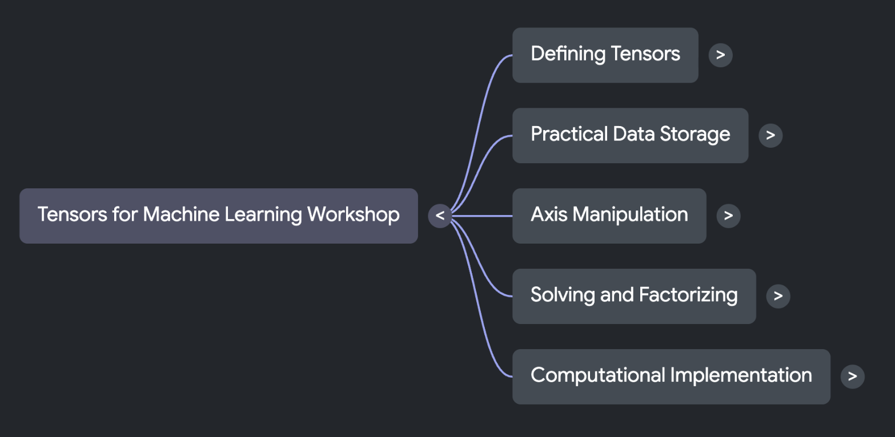

<!-- GENERATED by scripts/gen_tables.py from _variables.yml. Do not edit by hand. -->
Abre una vista previa para probar la actividad en NotebookLM.

::: {.info-strip}
::: {.info-card}
[{fig-alt="El mapa mental plegado a su primer nivel: un nodo que dice Tensors for Machine Learning Workshop, del que salen cinco ramas — Defining Tensors, Practical Data Storage, Axis Manipulation, Solving and Factorizing y Computational Implementation — cada una con una flecha que la despliega."}](https://notebook.google.com/notebook/29755b94-43c4-46ca-83b8-8cf0524f040c/artifact/609426f1-af07-4b0d-8aa4-91fd6d633d87)

**[Mapa mental](https://notebook.google.com/notebook/29755b94-43c4-46ca-83b8-8cf0524f040c/artifact/609426f1-af07-4b0d-8aa4-91fd6d633d87)** Cinco ramas conectan las ideas del taller. *Abre una rama para explorar.*
 [Se abre en NotebookLM. Vista previa de la actividad interactiva.]{.shot-note}
:::
:::
