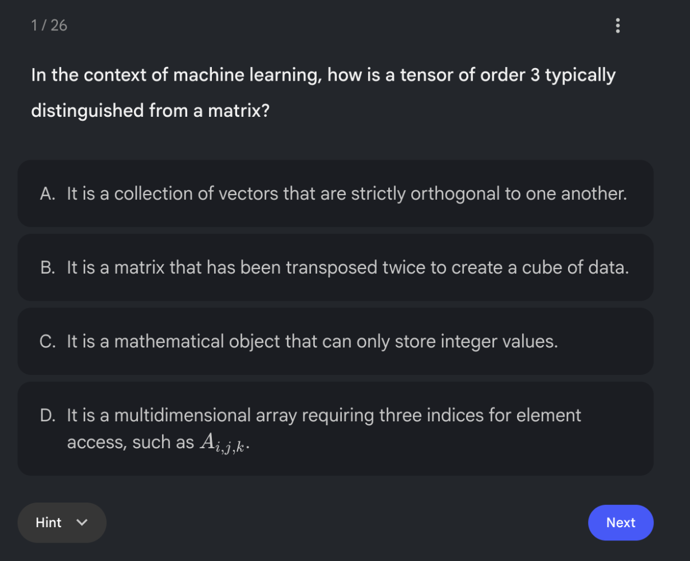
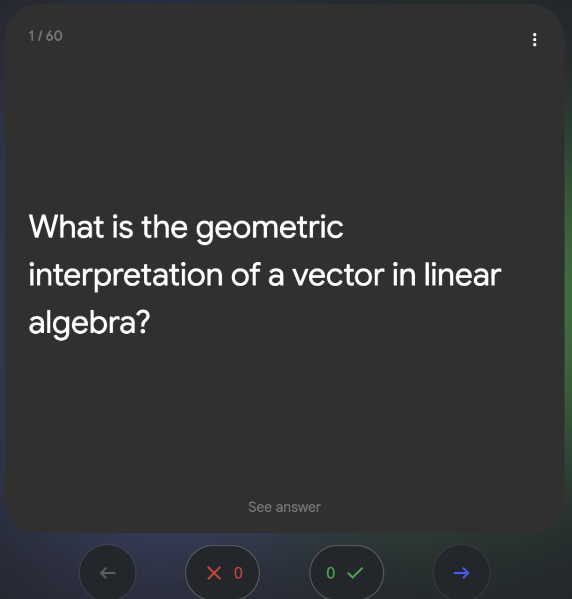

<!-- GENERATED by scripts/gen_tables.py from _variables.yml. Do not edit by hand. -->
Las imágenes son capturas de pantalla, servidas desde este sitio. Mira una antes de gastar una cuenta en el clic.

::: {.info-strip}
::: {.info-card}
[{fig-alt="La primera de las veintiséis preguntas del cuestionario, tal como la muestra NotebookLM: cómo se distingue un tensor de orden 3 de una matriz, con cuatro respuestas de la A a la D y un botón de pista junto a Siguiente."}](https://notebook.google.com/notebook/29755b94-43c4-46ca-83b8-8cf0524f040c/artifact/72379ae0-b758-4fa9-b203-b68ed934b59a)

**[Cuestionario de autoevaluación](https://notebook.google.com/notebook/29755b94-43c4-46ca-83b8-8cf0524f040c/artifact/72379ae0-b758-4fa9-b203-b68ed934b59a)** Veintiséis preguntas de opción múltiple generadas, de la sección 00 a la sección 12. *Después de la sesión, para descubrir qué secciones no se te quedaron.*
 [Se abre en NotebookLM; pide una cuenta de Google. Captura de pantalla; el de verdad es interactivo, en NotebookLM.]{.shot-note}
:::
::: {.info-card}
[{fig-alt="La primera de sesenta tarjetas, por la cara delantera: cuál es la interpretación geométrica de un vector en álgebra lineal, con la indicación Ver respuesta debajo y los contadores de acertadas y falladas bajo la tarjeta."}](https://notebook.google.com/notebook/29755b94-43c4-46ca-83b8-8cf0524f040c/artifact/b4168432-9dda-4495-adb9-36f5b0277a03)

**[Tarjetas de memoria](https://notebook.google.com/notebook/29755b94-43c4-46ca-83b8-8cf0524f040c/artifact/b4168432-9dda-4495-adb9-36f5b0277a03)** Sesenta tarjetas, pregunta por un lado y respuesta por el otro, sobre el álgebra lineal además de los tensores. *Repetición espaciada, en las semanas siguientes.*
 [Se abre en NotebookLM; pide una cuenta de Google. Captura de pantalla; el de verdad es interactivo, en NotebookLM.]{.shot-note}
:::
:::
