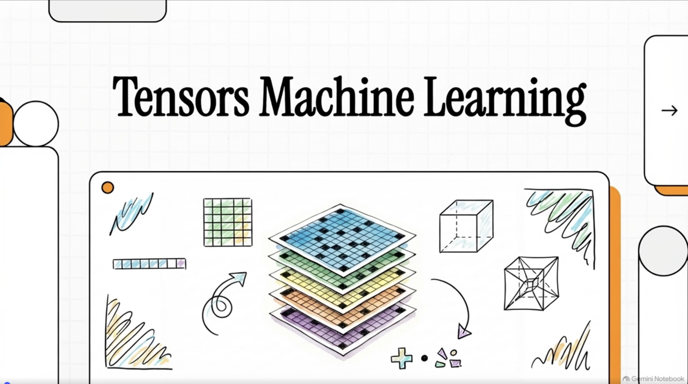

<!-- GENERATED by scripts/gen_tables.py from _variables.yml. Do not edit by hand. -->
::: {.poster-frame}
[{fig-alt="Ver el vídeo de NotebookLM: Tensors Machine Learning, ilustrado con cortes de un tensor apilados."}](https://notebook.google.com/notebook/29755b94-43c4-46ca-83b8-8cf0524f040c/artifact/4cd12b58-ba38-428b-9f0f-c16d76ce6bb7)
:::

**[Tensores en aprendizaje automático — resumen en vídeo](https://notebook.google.com/notebook/29755b94-43c4-46ca-83b8-8cf0524f040c/artifact/4cd12b58-ba38-428b-9f0f-c16d76ce6bb7)** — Ver en NotebookLM.
