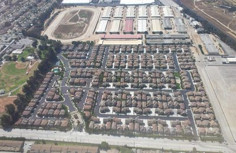
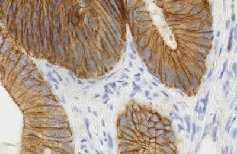
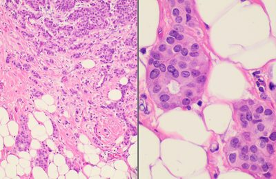

::: {.callout-note appearance="simple"}
🇬🇧 Prefer English? [This page in English](../index.qmd). El taller se imparte en
inglés, pero puedes preguntar en español cuando quieras.
:::

## Qué es esto

Un taller de  minutos que te lleva de «sé lo que es una
matriz» a «sé manipular, resolver, convolucionar y factorizar tensores». Está
construido **solo con datos reales**: medidas reales de tumores, dígitos
manuscritos reales, imágenes reales de histología, viajes reales en taxi de Nueva
York, tráfico aéreo real. No hay nada inventado con números aleatorios, porque los
datos reales contienen problemas que los aleatorios nunca muestran: valores
faltantes, variables en escalas incompatibles, píxeles que nunca cambian.
Encontrar esos problemas es parte del trabajo.

## Para quién es

Has leído **. Sabes qué es una matriz. Este taller **no
supone ningún conocimiento previo de teoría de tensores**, y cada término nuevo se
define donde aparece por primera vez.

## Qué hay aquí

Cinco recursos, y cada uno cumple una función distinta. Empieza por el que
corresponda a lo que estés haciendo ahora mismo.

| | Qué es | Cuándo lo usas |
|---|---|---|
| **[Manual](../tensors_workshop_plan_with_quizzes.md)** | El texto de la sesión: la teoría, todos los ejercicios, las soluciones comentadas, la lectura adicional y los cinco apéndices para casa. **Solo en inglés.** | Léelo antes, síguelo durante, consérvalo después. |
| **[Diapositivas](../slides/es/index.qmd)** · [EN](../slides/en/index.qmd) | Lo que se proyecta en la sala, con el reloj de la sesión y una miga de pan que indica en qué sección estás. | En vivo durante la sesión, o para repasar después la forma del día. |
| **[Cuadernos](../notebooks.qmd)** | Catorce cuadernos de Colab: uno por sección, más dos estudios a fondo para casa. Donde realmente escribes código. | Durante cada sección, y para los ejercicios de casa. |
| **[Kahoot](../kahoot.qmd)** | Tres controles de conocimiento de 6 preguntas, después de las secciones 04, 07 y 10. | En vivo, en el móvil o en una segunda pestaña. |
| **[Repositorio]()** | La fuente de todo lo anterior, más las tres hojas de cálculo de Kahoot. | Para clonarlo, corregir algo o ejecutar los cuadernos fuera de Colab. |

: {tbl-colwidths="[16,50,34]"}

El manual es el *texto* fuente. Los datos que los cinco comparten —los títulos
de las secciones, el reloj, los enlaces— viven una sola vez en
[`_variables.yml`](/blob//_variables.yml),
y todas las tablas de esta página se generan a partir de ahí, así que no pueden
contradecirse.

## Requisitos previos

Todo lo que sigue es gratuito y no hace falta instalar nada en tu equipo.

**Antes de la sesión**

- **El álgebra lineal de **: vectores, matrices, el
  producto matricial, la inversa, la descomposición espectral y la SVD. Ese
  capítulo es todo el conocimiento previo que se da por supuesto.
- **[`linear-algebra-deep-learning`]()**:
  14 cuadernos breves de Colab, bilingües (~2–3 horas en total), que cubren
  exactamente ese material, de vectores a PCA. Trabajo previo obligatorio: el
  taller avanza rápido y da por hecho que ya lo hiciste.
- **El [cuaderno 00](/00-setup-and-data.ipynb),
  ejecutado en Colab**: descarga los tres archivos CSV que usa el taller.
  Ejecútalo antes de la sesión y avisa enseguida si falla: una descarga que
  falla en silencio te deja atascado en las secciones 07 y 10, una hora
  después.

**Recomendado**

- **[*Essence of linear algebra*]()**
  (3Blue1Brown, en inglés con subtítulos): 16 vídeos, unas 3 horas en total.
  Míralo si el capítulo del libro te pareció puro manejo de símbolos: da la
  imagen geométrica de lo que una matriz *hace*, que es en lo que se apoyan
  las secciones 04 a 10.

**Ten a mano el día del taller**

- **Una cuenta de Google**: los cuadernos se ejecutan en
  [Colab](https://colab.research.google.com/) desde el navegador. No hay que
  instalar nada.
- **Discord**: la invitación te la pasa quien imparte el taller. Ahí ocurren
  las discusiones, los canales de grupo y las preguntas, en español o en
  inglés.
- **El móvil o una segunda pestaña para [Kahoot](../kahoot.qmd)**: tres
  controles de 6 preguntas, después de las secciones 04, 07 y 10. No hay que
  registrarse: entras con un PIN.

## Cómo ejecutar los cuadernos

Haz clic en cualquier enlace **Colab** de la tabla. El cuaderno se abre en tu
navegador, ya conectado a un entorno de ejecución gratuito.

1. Cada cuaderno es **autónomo**. Su celda de preparación instala e importa
   exactamente lo que esa sección necesita y carga sus propios datos, así que
   puedes abrir cualquiera en frío, en cualquier orden, sin haber ejecutado los
   demás.
2. Ejecuta primero la celda de preparación (▶ o `Shift+Enter`).
3. Trabaja las celdas `# TODO`. Cada una tiene debajo una celda de solución,
   plegada: ábrela después de intentarlo, no antes.
4. Colab avisará de que el cuaderno no lo escribió Google. Es lo esperado; el
   código fuente está [en GitHub](/tree//notebooks).

::: {.callout-tip appearance="simple"}
Los cambios que hagas en Colab **no** se guardan en este repositorio. Usa
*Archivo → Guardar una copia en Drive* para conservar tu trabajo.
:::

## Cómo trabajamos

Cuadernos en GitHub, ejecución en Colab, discusión en Discord. Dos ritmos:

- **Bloques de ejercicios**: 10 minutos programando y 5 de explicación.
- **Bloques de grupo**: 10 minutos de discusión en tu canal y luego puesta en común.

## De dónde vienen los datos

Todos los conjuntos de datos son reales, y cada uno es algo que alguien midió de
verdad. Nada en este taller se inventa con números aleatorios.

::: {.app-strip}
::: {.app-card}
{fig-alt="Taxis amarillos en una avenida de Manhattan, la ciudad cuyos 6.433 viajes forman el conjunto de datos de taxis."}

**Viajes en taxi de Nueva York** Descomposición de Tucker
:::

::: {.app-card}
{fig-alt="Vista aérea de hileras de viviendas en el sur de California, el tipo de distrito cuyo valor mediano forma el conjunto de datos de vivienda."}

**Vivienda en California** Mínimos cuadrados, pseudoinversa
:::

::: {.app-card}
{fig-alt="Tres fotogramas de una tormenta en l'Almadrava, separados por dos segundos; las olas cambian entre fotogramas, y por eso el eje temporal lleva información."}

**Grabación de una tormenta** Diseño de un pipeline de vídeo
:::

::: {.app-card}
{fig-alt="Glándulas colónicas teñidas por inmunohistoquímica, con la señal marrón de DAB marcando la expresión de FHL2 sobre un contraste azul de hematoxilina."}

**Cortes de histología** Reshape y transposición
:::

::: {.app-card}
{fig-alt="Dos vistas histopatológicas de carcinoma ductal invasivo de mama, el tipo de preparación del que proceden las mediciones de núcleos tumorales."}

**Mediciones de tumores** Indexación y broadcasting
:::

::: {.app-card}
{fig-alt="Un Douglas DC-3 en vuelo, el avión de la era 1949-1960 cuyos totales mensuales de pasajeros cuenta el conjunto de datos de vuelos."}

**Tráfico aéreo** Recursión y pronóstico
:::
:::

## Las secciones

Lee una fila de izquierda a derecha: las diapositivas en cualquiera de los dos
idiomas, el cuaderno que hay que ejecutar y el control de Kahoot que lo cubre. Las
filas 🎯 son los tres cuestionarios, en el orden real en que se ejecutan.



**No aparecen** en la tabla: las tres pausas de 5 minutos. Las doce secciones
suman 165 minutos; los tres cuestionarios añaden 15 y las pausas otros 15, que
es como la sesión llega a  minutos.

## Una nota sobre el idioma

El taller se imparte en inglés, pero muchos términos son casi idénticos en
español: *tensor/tensor*, *matrix/matriz*, *axis/eje*, *dimension/dimensión*,
*decomposition/descomposición*, *factorization/factorización*,
*contraction/contracción*, *convolution/convolución*, *recursion/recursión*.

**Pregunta en español o en inglés**, lo que te permita preguntar más rápido. Las
[diapositivas están en los dos idiomas](../slides/es/index.qmd) y cada
encabezado de los cuadernos lleva un resumen de una línea en español.
