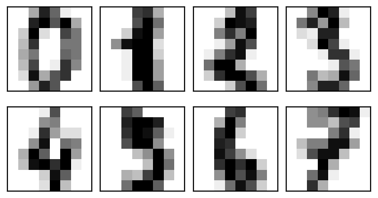
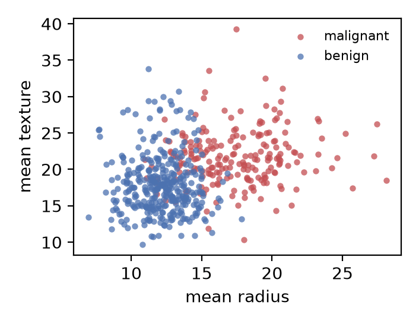
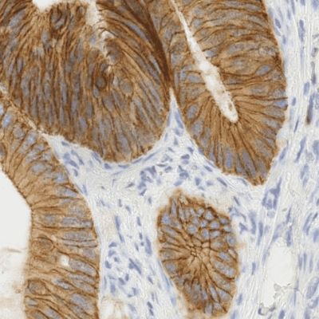
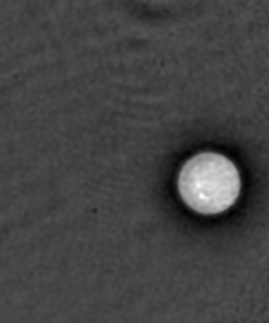
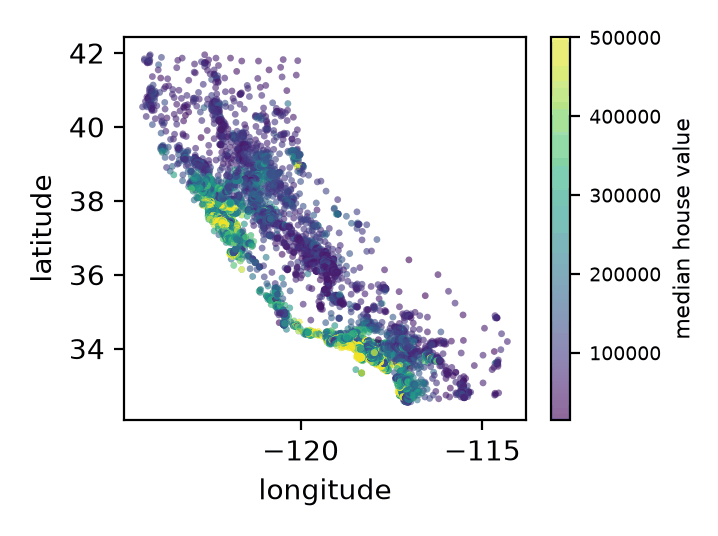
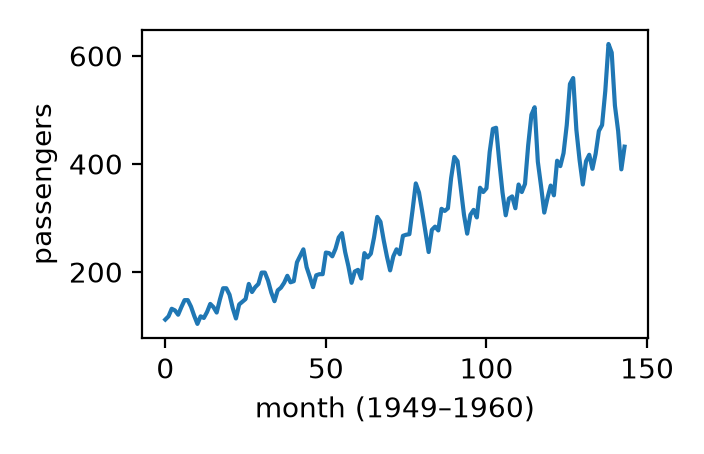
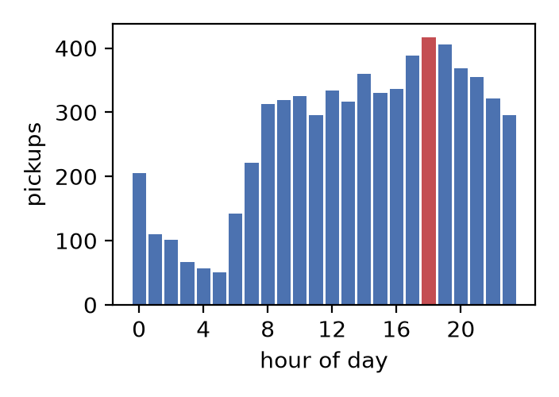

# Before we start {#sec-title}

**You have read** *Deep Learning*, Chapter 2 — Linear Algebra.
You know matrices.

**This workshop assumes no previous knowledge of tensor theory.**

::: {.notes}
Say this out loud: nobody is expected to know tensor theory. Every new term is
defined the first time it appears. Students are ESL (Colombia) — speak slowly,
avoid idiom, and name the Spanish cognates early: eje, descomposición,
contracción, convolución.
:::

## All the data here is real

::: {.incremental}
- Real tumour measurements, real handwritten digits, real histology
- Real taxi trips, real airline traffic
- **Nothing is invented with random numbers**
:::

. . .

Real data contains problems random data never shows — missing values, features
on incompatible scales, pixels that never change.

**Finding those problems is part of the work.**

## Agenda —  minutes

| Part | Segment | Time |
|---|---|---|
| — | Setup and welcome | 5 |
| I | What a tensor is | 20 |
| II | Thinking in N dimensions *(group)* | 20 |
| III | Indexing & broadcasting · Reshape & transpose | 30 |
| 🎯 | **Kahoot 1** + break | 10 |
| III | Video pipeline design *(group)* | 15 |
| IV | Contraction with einsum | 15 |
| — | Break | 5 |
| IV | Inverses and the pseudoinverse | 15 |
| 🎯 | **Kahoot 2** | 5 |
| IV | Recursion · Convolution | 25 |
| — | Break | 5 |
| IV | Tucker decomposition | 15 |
| 🎯 | **Kahoot 3** + wrap-up | 10 |

## Two rhythms, and one warning

**Exercise blocks** — 10 min coding, 5 min explanation.

**Group blocks** — 10 min discussion, then share-back.

. . .

::: {.callout-warning}
### The word "rank"
Chapter 2: *rank* = number of independent columns.
Tensor theory: *rank* often = number of axes.

**Today: "order" for the number of axes. "Rank" only in Chapter 2's sense.**
:::

::: {.notes}
Give this warning at the start of Part I, not later. It is the single most
reliable source of confusion in the whole workshop.
:::

# 00 · Setup and welcome {#sec-00-setup-and-data}

*5 min · run this before anything else*

## Three downloads, one first cell

```{python}
#| label: code-00-setup-and-data-1
#| echo: true
HOUSING = "https://raw.githubusercontent.com/ageron/handson-ml2/master/datasets/housing/housing.csv"
TAXIS   = "https://raw.githubusercontent.com/mwaskom/seaborn-data/master/taxis.csv"
FLIGHTS = "https://raw.githubusercontent.com/mwaskom/seaborn-data/master/flights.csv"

housing = pd.read_csv(HOUSING)
taxis   = pd.read_csv(TAXIS)
flights = pd.read_csv(FLIGHTS)
print(housing.shape, taxis.shape, flights.shape)   # (20640, 10) (6433, 14) (144, 3)
```

**If this fails, say so in Discord now** — not in two hours.

::: {.notes}
Confirm in the first 5 minutes that everyone's download succeeded. A student who
silently fails will be stuck at sections 07 and 10. Have the three CSVs mirrored
in the repo as a fallback.
:::

## To the notebook

::: {.columns}
::: {.column width="60%"}
**00 · Setup and welcome**

[Open in Colab](/00-setup-and-data.ipynb)

Everything else in the library ships offline: `load_breast_cancer`,
`load_digits`, `data.camera()`, `data.astronaut()`.
:::
::: {.column width="40%"}
{fig-alt="Grayscale thumbnail of the scikit-image camera photograph, a standard offline test image shipped with the library." width="220"}

{fig-alt="Small colour thumbnail of the scikit-image astronaut photograph, another standard offline test image shipped with the library." width="220"}
:::
:::

# 01 · What a tensor is {#sec-01-what-a-tensor-is}

*Part I · 20 min · demo*

## The vocabulary

| Term | Plain meaning | Spanish |
|---|---|---|
| **Tensor** | Array of numbers with any number of axes | *tensor* |
| **Axis** | One direction along which data is arranged | *eje* |
| **Order** | How many axes a tensor has | *orden* |
| **Shape** | The size along each axis | *forma* |
| **Slice** | Fix one index, keep the rest | *corte* |
| **Fiber** | Fix every index except one | *fibra* |
| **Unfolding** | Rearranging a tensor into a matrix | *desplegado* |
| **Contraction** | Multiply and sum over a shared axis | *contracción* |

## Shape is a tuple; order is its length

```{python}
#| label: code-01-what-a-tensor-is-1
#| echo: true
scalar = np.array(3.0)                     # order 0   shape ()
vector = np.array([1., 2., 3.])            # order 1   shape (3,)
matrix = np.array([[1., 2.], [3., 4.]])    # order 2   shape (2, 2)
tensor = rng.standard_normal((2, 3, 4))    # order 3   shape (2, 3, 4)
```

. . .

```{python}
#| label: code-01-what-a-tensor-is-2
#| echo: true
digits.images.shape              # (1797, 8, 8)  — images, height, width
photo.shape                      # (512, 512, 3) — height, width, colour
```

. . .

{fig-alt="Grid of eight real handwritten digits from the scikit-learn digits dataset, each an 8 by 8 pixel grayscale image shown with nearest-neighbour scaling so individual pixels stay visible — this is what shape (1797, 8, 8) means: 1797 such images." width="260"}

. . .

**Both are order 3. Their axes mean completely different things.**

The shape alone never tells you what the axes mean.

## Three operations {auto-animate="true"}

**Slice** — fix one index. **Fiber** — fix all but one.

```{python}
#| label: code-01-what-a-tensor-is-3
#| echo: true
photo[:, :, 0].shape       # (512, 512) — a slice: one colour channel
photo[100, 200, :].shape   # (3,)       — a fiber: one pixel's colours
```

## Three operations {auto-animate="true"}

**Unfolding** — turn any tensor into a matrix.

```{python}
#| label: code-01-what-a-tensor-is-4
#| echo: true
def unfold(T, axis):
    return np.moveaxis(T, axis, 0).reshape(T.shape[axis], -1)

unfold(photo, 0).shape   # (512, 1536)
unfold(photo, 2).shape   # (3, 262144) — each colour channel is one row
```

. . .

**Unfolding loses nothing.** Every matrix tool you know now applies.

## Three operations {auto-animate="true"}

**Contraction** — multiply along a shared axis and sum over it.

```{python}
#| label: code-01-what-a-tensor-is-5
#| echo: true
np.einsum('i,i->', a, b)          # dot product      (eq 2.8)
np.einsum('ik,kj->ij', A, B)      # matrix product   (eq 2.5)
```

. . .

::: {.callout-tip}
### The rule, in one sentence
An index in the inputs but **not** after the arrow is **summed over**.
An index after the arrow is **kept**.
:::

## The map of factorizations

| Method | Works on | Where today |
|---|---|---|
| LU | Square matrix | now |
| QR | Any matrix | now |
| Eigendecomposition | Square matrix | §08 |
| SVD | Any matrix | §07, §10 |
| **Pseudoinverse** | Any matrix | §07 |
| Cholesky | Symmetric positive-definite matrix | §11 |
| **Tucker / CP** | **Tensor, any order** | §10 |

. . .

Everything but the last row works on **two axes**. Real data has more.

## To the notebook

**01 · What a tensor is**

[Open in Colab](/01-what-a-tensor-is.ipynb)

::: {.notes}
Do not rush Part I. It is the students' first contact with tensor theory and
every later block uses its vocabulary. If running late, cut Appendix material,
never Part I.
:::

# 02 · Thinking in N dimensions {#sec-02-thinking-in-n-dimensions}

*Part II · 20 min · group discussion · no code*

## Your task

> A grayscale image is a matrix. Almost nothing in ML is a single grayscale
> image. Each thing you add — colour, many examples, time — adds an axis, and
> each axis means something different.

**Argue about which axis goes where, and why.**

10 minutes in your breakout channel, then share-back.

## The five questions

::: {.incremental}
1. `(H, W)` → colour image → batch → video → batch of videos. What does each
   new axis *count*? **Do not say "we add a dimension."**
2. A batch axis and a time axis look identical in code. What differs in
   **meaning**? What happens if you shuffle each?
3. Real videos have different lengths. Two ways to batch them — what does each
   **lose or invent**?
4. Cells photographed every 10 min for 48 h: frame interval → ? field of view →
   ? number of dishes → ?
5. Is there a limit on how many axes a tensor can have?
:::

## Share-back

```{python}
#| label: code-02-thinking-in-n-dimensions-1
#| echo: true
gray_image      = np.zeros((28, 28))            # (H, W)
color_image     = np.zeros((28, 28, 3))         # (H, W, C)      + colour
batch_of_images = np.zeros((32, 28, 28, 3))     # (N, H, W, C)   + many examples
video           = np.zeros((16, 28, 28, 3))     # (T, H, W, C)   + ordered time
batch_of_videos = np.zeros((8, 16, 28, 28, 3))  # (N, T, H, W, C)
```

. . .

**Question 2 is the point.** Shuffling axis 0 is harmless for a batch and
**destroys** a video.

Chapter 2's notation has no concept of "order matters between elements."
That is genuinely new today.

## To the notebook

**02 · Thinking in N dimensions**

[Open in Colab](/02-thinking-in-n-dimensions.ipynb)

::: {.notes}
Group blocks need firmer facilitation than exercise blocks. If a group is still
on question 1 with 5 minutes left, join their channel and tell them to sketch
anything, even a wrong shape. The share-back matters more than a correct sketch.
Pre-assign breakout groups before the session.
:::

# 03 · Indexing and broadcasting {#sec-03-indexing-and-broadcasting}

*Part III · 15 min · exercise*

## Why this matters

::: {.columns}
::: {.column width="55%"}
569 real patients, 30 real measurements of tumour cell nuclei.

::: {.incremental}
- Selecting the wrong column **does not produce an error**
- It returns a *different real measurement*
- Your analysis continues and gives a confident, wrong answer
:::
:::
::: {.column width="45%"}
{fig-alt="Scatter plot of mean radius against mean texture for 569 patients in the scikit-learn breast cancer dataset, coloured by malignant versus benign diagnosis; two of the dataset's 30 measurements, not the full picture." width="300"}
:::
:::

. . .

In research: results nobody can reproduce.
In a clinical tool: a wrong recommendation about a real person.

## The exercise

```{python}
#| label: code-03-indexing-and-broadcasting-1
#| echo: true
# TODO 2: Extract "mean radius" using names.index(...). Do not hard-code a number.
# TODO 3: The 5 patients with the LARGEST mean radius, full profiles, ONE operation.
# TODO 4: Boolean indexing — malignant (y == 0) vs benign (y == 1). Real difference?
# TODO 6: Standardize with broadcasting: (D - mean) / std. LOOK AT THE RESULT.
# TODO 7: You will find NaN. How many pixels have std == 0, and why?
```

## Two real results

```{python}
#| label: code-03-indexing-and-broadcasting-2
#| echo: true
print(radius[y == 0].mean(), radius[y == 1].mean())   # 17.5 vs 12.1
print((std == 0).sum())                               # 3
Z = (D - mean) / np.where(std == 0, 1.0, std)
```

. . .

**Malignant tumours really do have a larger mean radius** — 17.5 against 12.1.

. . .

**Three pixels are always dark** in all 1797 digit images — corners where nobody
writes. Standard deviation exactly zero → `NaN`.

**Random data would never have shown you this.**

## To the notebook

**03 · Indexing and broadcasting real data**

[Open in Colab](/03-indexing-and-broadcasting.ipynb)

# 04 · Reshape and transpose {#sec-04-reshape-and-transpose}

*Part III · 15 min · exercise*

## Why this matters

::: {.columns}
::: {.column width="60%"}
Microscopes and cameras order their axes according to the **hardware**, not
according to what a model expects.

. . .

Getting this wrong does not crash. The model runs on scrambled data and returns
**confident, meaningless output**.

. . .

The famous version: a model trained in TensorFlow (`NHWC`) deployed into
PyTorch (`NCHW`) with no transpose.
:::
::: {.column width="40%"}
{fig-alt="Colour immunohistochemistry-stained tissue image from scikit-image, an example microscopy image whose colour channels are ordered by the imaging hardware." width="240"}

{fig-alt="Grayscale microscopy image of a single cell from scikit-image, another example of hardware-ordered image axes." width="240"}
:::
:::

## Same shape, different data

```{python}
#| label: code-04-reshape-and-transpose-1
#| echo: true
chw   = np.transpose(photo, (2, 0, 1))      # (3, 512, 512) — correct
wrong = photo.reshape(3, 512, 512)          # (3, 512, 512) — runs, but scrambles

np.array_equal(chw, wrong)                  # False
```

. . .

**Reshape only reinterprets numbers in memory order.**
**Transpose moves them according to axis meaning.**

## When two axes share a size

```{python}
#| label: code-04-reshape-and-transpose-2
#| echo: true
batch = np.stack([photo, photo, photo])      # (3, 512, 512, 3)
nchw  = np.transpose(batch, (0, 3, 1, 2))    # (3, 3, 512, 512)
```

. . .

Two axes now both have size 3. **How do you know which is which?**

. . .

You do not. **Only your own tracking can tell you.**
Nothing in the array records it.

## To the notebook

**04 · Reshape and transpose real images**

[Open in Colab](/04-reshape-and-transpose.ipynb)

# 🎯 Kahoot 1 {#sec-kahoot-1 background-color="#b3541e"}

## Kahoot 1 — 

** questions · about 5 minutes**

### Join at ****

### PIN on screen

*Covers: order, axis, shape, slice, fiber, variance, reshape, transpose*

[Quiz details](/kahoot.html#quiz-1)

::: {.notes}
Run this before the break, right after section 04. Everyone has just used order,
axis, shape, slice, fiber, variance, reshape and transpose — this is the moment
those words are freshest.

IMPORT THE .xlsx AHEAD OF TIME. Create → Add question → Import → Import
spreadsheet. Do not do this live.

Budget 5 minutes including the podium. Groups want to see the leaderboard, and
that is fine — it is the payoff.

Two questions reach into the exercises: the NaN question is section 03's
zero-variance pixels, and the last is section 04's reshape-versus-transpose.

If you are badly over time, this is the last quiz to cut — cut Kahoot 2 first.
:::

# 05 · Video pipeline design {#sec-05-video-pipeline-design}

*Part III · 15 min · group discussion*

## Design both pipelines

*raw file → decoded frames → preprocessed batch → model input → model output*

**Tech** — a short-video app computing one embedding per video from sampled
frames.

**Biotech** — a surgical-video model labelling the current phase of an operation.

. . .

**There is no single correct answer.**

## The five questions

::: {.incremental}
1. Sketch the shape at each of the five stages, for both. Where must they differ?
2. 30 seconds against 4 hours. Give the exact preprocessed batch shape. What does
   an invented or wasted value **represent**?
3. Three camera angles at once. **Where does that axis go?**
4. 8 frames sampled from 900 — which operation from §03, and what is lost?
5. Which frames matter most? **What could learn that weighting?**
:::

## Where they diverge

```{python}
#| label: code-05-video-pipeline-design-1
#| echo: true
# Tech: time is DESTROYED on purpose
# preprocessed (32, 8, 224, 224, 3)  ->  output (32, 512)      N, embedding

# Biotech: time SURVIVES, one label per timestep
# preprocessed (4, 64, 224, 224, 3)  ->  output (4, 64, 12)    N, T, classes
```

. . .

**Q5 is attention** — §11 builds it from two `einsum` calls, and the padding mask
from Q2 turns out to be the same mask attention needs.

## To the notebook

**05 · Video pipeline design**

[Open in Colab](/05-video-pipeline-design.ipynb)

# 06 · Contraction with einsum {#sec-06-contraction-with-einsum}

*Part IV · 15 min · exercise*

## Why this matters

Recommendation and search rank items by the dot product between a user vector
and **every** item vector — millions of items, many times per second.

**That contraction *is* the ranking signal.**

Sum over the wrong axis and every user gets wrong results.

## One letter for a batch

```{python}
#| label: code-06-contraction-with-einsum-1
#| echo: true
gray       = np.einsum('hwc,c->hw',   photo, w)      # (512, 512)
gray_batch = np.einsum('nhwc,c->nhw', batch, w)      # (2, 512, 512)
```

. . .

`c` is in the inputs but not after the arrow → **summed over**.
`n`, `h`, `w` are after the arrow → **kept**.

. . .

**Adding a batch axis costs exactly one letter.**

## Chapter 2, rewritten

```{python}
#| label: code-06-contraction-with-einsum-2
#| echo: true
np.einsum('ii->', A)           # trace          == np.trace(A)      (eq 2.48)
np.einsum('ij->ji', A)         # transpose      == A.T              (eq 2.3)
np.einsum('ik,kj->ij', A, B)   # matrix product == A @ B            (eq 2.5)
```

. . .

The same expression works for one image or for a million, and **it reads like
the mathematics in Chapter 2.**

## Every pair of 1797 images

```{python}
#| label: code-06-contraction-with-einsum-3
#| echo: true
D = load_digits().images.reshape(1797, -1)     # (1797, 64)
S = np.einsum('id,jd->ij', D, D)               # (1797, 1797) — 3.2M scores
```

. . .

Normalize the rows first and the same contraction becomes **cosine similarity**.

$$\text{cos}(u, v) = \frac{u \cdot v}{\lVert u \rVert \, \lVert v \rVert}
\qquad
d(u,v) = \sqrt{\textstyle\sum_i (u_i - v_i)^2}$$

::: {.notes}
Say "Euclidean distance" and "cosine similarity" out loud here. Kahoot 2 asks
about both and the handbook never defines them anywhere else — this exercise is
the only bridge.
:::

## To the notebook

**06 · Contraction with einsum**

[Open in Colab](/06-contraction-with-einsum.ipynb)

# 07 · Inverses and the pseudoinverse {#sec-07-inverses-and-pseudoinverse}

*Part IV · 15 min · exercise*

## Step 1 — square matrices

```{python}
#| label: code-07-inverses-and-pseudoinverse-1
#| echo: true
Singular = np.array([[1., 2.], [2., 4.]])   # column 2 = 2 x column 1
np.linalg.inv(Singular)                      # LinAlgError
```

. . .

$A^{-1}$ exists **only** when the columns are linearly independent.

## Step 2 — non-square matrices

In machine learning `A` is almost never square: one row per example, one column
per feature, **always far more examples than features**.

. . .

The **Moore-Penrose pseudoinverse** is defined for *every* matrix:

$$A^{+} = V D^{+} U^{\top}$$

```{python}
#| label: code-07-inverses-and-pseudoinverse-2
#| echo: true
A_plus = np.linalg.pinv(A)
U, S_, Vt = np.linalg.svd(A, full_matrices=False)
np.allclose(A_plus, Vt.T @ np.diag(1 / S_) @ U.T)     # True — eq 2.47
```

## What $A^{+}b$ gives you

::: {.incremental}
- **Tall** (too many equations, no exact solution) → the `x` making `Ax` as
  **close as possible** to `b`. **Least squares.**
- **Wide** (too few equations, infinitely many solutions) → the valid solution
  with the **smallest norm**.
:::

. . .

**Step 3 — tensors?** No single tensor inverse everyone uses.
In practice: **unfold → pseudoinverse → fold back.** It works because unfolding
loses nothing.

## 20,433 equations, no solution

```{python}
#| label: code-07-inverses-and-pseudoinverse-3
#| echo: true
d = housing.dropna()                                # 20433 rows; 207 had NaN
X = np.column_stack([np.ones(len(d)), d[feats].to_numpy(float)])   # (20433, 7)

w = np.linalg.pinv(X) @ y
w_lstsq, *_ = np.linalg.lstsq(X, y, rcond=None)
np.allclose(w, w_lstsq)                             # True

rmse = np.sqrt(((X @ w - y) ** 2).mean())           # ~75,980
```

. . .

{fig-alt="Scatter map of California housing districts plotted by longitude and latitude, coloured by median house value, showing the coastal concentration of expensive housing in the same dataset used for the least-squares fit." width="300"}

. . .

**No straight line passes through 20,433 points.** The pseudoinverse gives the
best possible answer instead. Largest coefficient: `median_income`. Sensible.

::: {.notes}
TODO 3 asks students to trigger an error deliberately — say in advance that the
error is the expected result, or several will think they broke something.
:::

## To the notebook

**07 · Inverses and the pseudoinverse**

[Open in Colab](/07-inverses-and-pseudoinverse.ipynb)

# 🎯 Kahoot 2 {#sec-kahoot-2 background-color="#b3541e"}

## Kahoot 2 — 

** questions · about 5 minutes**

### Join at ****

### PIN on screen

*Covers: contraction, the pseudoinverse, singular matrices, distance*

[Quiz details](/kahoot.html#quiz-2)

::: {.notes}
Run this right after section 07, before the recursion demo. It covers contraction
(§06), the pseudoinverse and singular matrices (§07), and distance/similarity —
the digit-similarity matrix from §06 TODO 4 is the bridge between the two.

WARNING: two questions ask about Euclidean distance and cosine similarity, which
the handbook never defines directly. If you did not say those words during §06,
expect them to land cold.

THIS IS THE FIRST QUIZ TO CUT if you are over time — the pseudoinverse and
distance both get re-covered narratively in the wrap-up.
:::

# 08 · Recursion with matrices {#sec-08-recursion-with-matrices}

*Part IV · 10 min · demo*

## Apply the same matrix again and again

```{python}
#| label: code-08-recursion-with-matrices-1
#| echo: true
F = np.array([[1, 1], [1, 0]])              # f(n) = f(n-1) + f(n-2)
v = np.array([1, 0])
for _ in range(10):
    v = F @ v
v[1]                                         # 55
np.linalg.matrix_power(F, 10)[0, 1]          # 55 — same answer, one step
```

## Power iteration finds an eigenvector

```{python}
#| label: code-08-recursion-with-matrices-2
#| echo: true
x = rng.standard_normal(2); x /= np.linalg.norm(x)
for _ in range(50):
    x = A @ x
    x /= np.linalg.norm(x)

x @ A @ x                       # 5.000000
np.linalg.eig(A)[0].max()       # 5.000000 — identical
```

. . .

**Repeated application of a matrix converges to its dominant eigenvector.**
This is how PageRank ranks web pages.

## Forecasting real airline traffic

```{python}
#| label: code-08-recursion-with-matrices-3
#| echo: true
y = flights['passengers'].to_numpy(float)     # 144 real months, 1949–1960
rows = np.array([y[i:i+12] for i in range(len(y) - 12)])
X = np.column_stack([np.ones(len(rows)), rows])
w = np.linalg.pinv(X) @ y[12:]                # least squares, exactly as in §07

history = list(y[-12:])
for _ in range(12):                           # feed predictions back in
    history.append(w[0] + np.dot(w[1:], history[-12:]))
```

. . .

{fig-alt="Line chart of monthly airline passenger counts from 1949 to 1960, the 144-month series used for the forecast, showing a rising trend with a repeating yearly summer peak." width="300"}

. . .

`[465.2 429.1 455.1 491.0 527.8 589.4 679.7 661.3 575.3 509.5 438.6 470.7]`

**Low in winter, peaking in summer** — learned from 132 real training windows.

## That is a recurrent neural network

```{python}
#| label: code-08-recursion-with-matrices-4
#| echo: true
h = np.zeros(4)
for t in range(6):
    h = np.tanh(W @ h + U @ xs[t])    # same W and U every step — the recursion
```

**A hidden state, updated by the same weights at every step.**

::: {.notes}
If badly over time, this RNN snippet is third on the cutting list — after Kahoot
2 and §09 TODO 4.
:::

## To the notebook

**08 · Recursion with matrices and vectors**

[Open in Colab](/08-recursion-with-matrices.ipynb)

# 09 · Convolution and deconvolution {#sec-09-convolution-and-deconvolution}

*Part IV · 15 min · exercise*

## Three modes, three output sizes

```{python}
#| label: code-09-convolution-and-deconvolution-1
#| echo: true
np.convolve(x, k, 'full')    # length 5+3-1 = 7
np.convolve(x, k, 'valid')   # length 5-3+1 = 3
np.convolve(x, k, 'same')    # length 5
```

. . .

`valid` uses only positions where the kernel fits completely — this is why
convolution **shrinks** an image by `kernel_size - 1`.

## What everyone gets wrong

::: {.callout-warning}
True convolution **flips** the kernel. Correlation does not.
**What deep learning libraries call "convolution" is actually correlation.**
:::

```{python}
#| label: code-09-convolution-and-deconvolution-2
#| echo: true
np.correlate(x, k, 'valid')          # [-2. -2. -2.]
np.convolve(x, k[::-1], 'valid')     # [-2. -2. -2.] — same, with k flipped
```

. . .

It makes no practical difference — the network *learns* the kernel — but the
names are inconsistent and you should know it.

## Convolution is a matrix product

```{python}
#| label: code-09-convolution-and-deconvolution-3
#| echo: true
C = toeplitz(col, row)                          # (7, 5)
np.allclose(C @ x, np.convolve(x, k, 'full'))   # True
```

. . .

A **Toeplitz** matrix: the same few numbers reused across the whole matrix.

**That reuse is exactly why CNNs need so many fewer parameters** than fully
connected networks.

## "Deconvolution" means two things

::: {.incremental}
1. **Transposed convolution** — the upsampling layer in a decoder or GAN.
   Makes things *bigger*. **Not a true inverse**; the name is historical.
2. **True deconvolution** — recovering the original from a blurred one.
   A genuine inverse problem, and where §07 comes back.
:::

## Deconvolving a real photograph

```{python}
#| label: code-09-convolution-and-deconvolution-4
#| echo: true
recovered = richardson_lucy(np.clip(noisy, 0, 1), psf, num_iter=50)

c = 25   # IGNORE THE BORDER — deconvolution always creates edge artifacts
err = lambda a: np.linalg.norm((a-img)[c:-c,c:-c]) / np.linalg.norm(img[c:-c,c:-c])
print(err(noisy), err(recovered))     # 0.1157 -> 0.0815
```

. . .

**Error reduced by about 30%.**

::: {.callout-important}
Flag the 25-pixel crop **before** the exercise. Students who skip it will
conclude deconvolution failed. It did not.
:::

::: {.notes}
This is the hardest thing in the workshop. TODO 4 is second on the cutting list.
Say the border-crop warning out loud before they start, not after.
:::

## Why not just invert the blur?

```{python}
#| label: code-09-convolution-and-deconvolution-5
#| echo: true
K = np.fft.fft2(psf, s=img.shape)
naive = np.real(np.fft.ifft2(np.fft.fft2(noisy) / np.where(abs(K) < 1e-3, 1e-3, K)))
err(naive)     # ~2.49 — about twenty times WORSE than the blur we started from
```

. . .

Blurring destroys high-frequency detail, so inverting divides by numbers very
close to zero and **amplifies noise enormously**.

. . .

**Same lesson as §07:** a direct inverse either does not exist or is unusable, so
you find the best stable answer instead.

## To the notebook

**09 · Convolution and deconvolution**

[Open in Colab](/09-convolution-and-deconvolution.ipynb)

# 10 · Tucker decomposition {#sec-10-tucker-decomposition}

*Part IV · 15 min · exercise*

## PCA generalized to every axis

PCA compresses a **matrix** — two axes. Real data often has more.

**Tucker**: one **factor matrix per axis**, plus a small **core tensor**
describing how the factors combine.

. . .

**HOSVD** uses only tools you already have:

::: {.incremental}
1. **Unfold** the tensor along each axis *(§01)*
2. **SVD** on each unfolding; keep the top components
3. **Contract** the tensor against all factors to get the core *(§06)*
:::

## A real order-3 tensor

**pickup borough × dropoff borough × hour of day**, from 6,433 real NYC taxi
trips.

```{python}
#| label: code-10-tucker-decomposition-1
#| echo: true
T = np.zeros((len(pb), len(db), 24))
for (p, d, h), v in sub.groupby(['pickup_borough','dropoff_borough','hour']).size().items():
    T[pb.index(p), db.index(d), h] = v
```

. . .

{fig-alt="Bar chart of NYC taxi pickup counts by hour of day from the same 6,433-trip dataset, rising through the day to a peak around hour 18, the evening rush the Tucker decomposition later rediscovers on its own." width="300"}

. . .

`T[i, j, k]` = trips from borough `i` to borough `j` picked up during hour `k`.

## Three axes, one einsum

```{python}
#| label: code-10-tucker-decomposition-2
#| echo: true
Us = [np.linalg.svd(unfold(T, ax), full_matrices=False)[0] for ax in range(3)]
Us = [Us[i][:, :r[i]] for i in range(3)]                     # r = (2, 2, 3)

core  = np.einsum('ijk,ia,jb,kc->abc', T, Us[0], Us[1], Us[2])   # (2, 2, 3)
recon = np.einsum('abc,ia,jb,kc->ijk', core, Us[0], Us[1], Us[2])

error = np.linalg.norm(T - recon) / np.linalg.norm(T)            # 0.067
ratio = T.size / (core.size + sum(u.size for u in Us))           # 4.71
```

. . .

`'ijk,ia,jb,kc->abc'` contracts **three axes in one expression.**
**That is why einsum came first.**

## What it found by itself

**4.7× fewer numbers, 6.7% error.** But that is not the point.

. . .

```{python}
#| label: code-10-tucker-decomposition-3
#| echo: true
np.abs(Us[2][:, 0]).argmax()      # 18
T.sum(axis=(0, 1)).argmax()       # 18 — the same hour, from raw counts
```

. . .

**The decomposition discovered evening rush hour by itself.**

Nobody told it about time, traffic or commuting. It found the dominant pattern
along that axis because that is what a decomposition does.

## To the notebook

**10 · Tucker decomposition on real data**

[Open in Colab](/10-tucker-decomposition.ipynb)

::: {.notes}
Never cut section 10. In tech, Tucker and CP compress neural network weight
tensors so models run on phones. In biotech, on (genes × samples × conditions),
they find structure PCA cannot reach — PCA can only ever see two axes.
:::

# 🎯 Kahoot 3 {#sec-kahoot-3 background-color="#b3541e"}

## Kahoot 3 — 

** questions · about 5 minutes**

### Join at ****

### PIN on screen

*Covers: convolution, correlation, Tucker, CP, HOSVD*

[Quiz details](/kahoot.html#quiz-3)

::: {.notes}
Run this right after section 10, while the taxi-tensor rush-hour result is still
on screen.

ITS LAST QUESTION NAMES HOUR 18 — it must come AFTER §10 TODO 6, never before,
or it gives the answer away.

NEVER CUT THIS ONE. It is the cheapest way to check whether Tucker and CP
actually landed before students leave. It also doubles as a live rehearsal of the
wrap-up's own recap, so segue straight from the podium into the wrap-up.
:::

# 11 · Wrap-up {#sec-11-wrap-up-and-take-homes}

*5 min*

## What you did today

::: {.incremental}
- **§01** — the vocabulary, and that unfolding loses nothing
- **§02, §05** — a batch axis and a time axis behave differently even when the
  shapes look identical
- **§03, §04** — real tumour data and real medical images, and real problems:
  zero-variance pixels, reshape silently destroying an image
- **§06–§10** — contractions; an unsolvable 20,433-equation system; recursion
  that forecasts real airline traffic; a deconvolved photograph; a taxi tensor
  compressed 4.7×, which found rush hour on its own
:::

## One idea connects §07, §09 and §10

::: {.callout-tip}
### When a problem has no exact answer or no true inverse, you do not give up — you find the best stable approximation.
:::

::: {.incremental}
- **Pseudoinverse** — for linear systems
- **Richardson-Lucy** — for blurred images
- **Tucker** — for tensors too large to keep in full
:::

::: {.notes}
Stating this connection explicitly is what makes the second half feel like one
lesson rather than four separate blocks. Do not skip it.
:::

## Where to go next

- `torch.einsum` / `tf.einsum` / `jnp.einsum` — **identical syntax** to today
- [`tensorly`](https://tensorly.org) — proper Tucker and CP
- `np.linalg` — the rest of Chapter 2: `eig`, `lstsq`, `pinv`, `qr`, `cholesky`
- `scipy.signal`, `skimage.restoration` — convolution and deconvolution beyond today
- [Further Reading](../../tensors_workshop_plan_with_quizzes.md#further-reading) — books and the seminal papers behind Tucker, CP and SVD

. . .

**Four take-homes** in [notebook 11](/11-wrap-up-and-take-homes.ipynb):
the PCA scaling trap, attention as two contractions, CP compared to Tucker, and
building correlated portfolios with Cholesky.

## Thank you

**Questions welcome in Discord — in Spanish or English.**

[Workshop site](/) ·
[Handbook](/tensors_workshop_plan_with_quizzes.html) ·
[All notebooks](/notebooks.html) ·
[Estas diapositivas en español](../es/)
