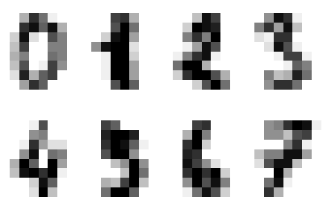
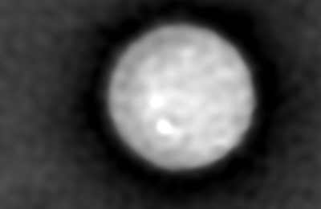
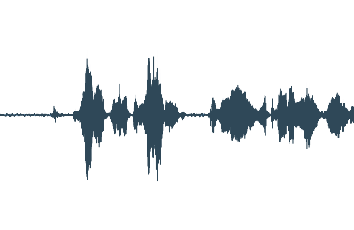

# Antes de empezar {#sec-title}

**Has leído** *Deep Learning*, capítulo 2 — Álgebra lineal.
Sabes qué es una matriz.

**Este taller no supone ningún conocimiento previo de teoría de tensores.**

::: {.notes}
Dilo en voz alta: nadie tiene por qué saber teoría de tensores. Cada término
nuevo se define la primera vez que aparece. Habla despacio y evita modismos;
nombra pronto los cognados: eje, descomposición, contracción, convolución.
:::

## Aquí no hay nada inventado {#todos-los-datos-son-reales .data-slide}

Once conjuntos de datos. Todos medidos sobre algo que existe.

::: {.dataset-grid}
::: {.ds}
{fig-alt="Taxis amarillos en fila en una avenida de Manhattan, la ciudad cuyos 6.433 registros de viajes forman el conjunto de datos taxis."}

[Viajes en taxi de Nueva York](https://github.com/mwaskom/seaborn-data)

6.433 viajes · §10
:::

::: {.ds}
{fig-alt="Un avión de pasajeros Douglas DC-3 en vuelo, el aparato de la época de 1949 a 1960 cuyos totales mensuales de pasajeros cuenta el conjunto de datos flights."}

[Pasajeros aéreos](https://github.com/mwaskom/seaborn-data)

144 meses, 1949–60 · §08
:::

::: {.ds}
{fig-alt="Ocho dígitos manuscritos de load_digits de scikit-learn, cada uno de 8 por 8 píxeles, mostrados sin suavizado para que se vean los píxeles individuales."}

[Dígitos manuscritos](https://scikit-learn.org/stable/datasets/toy_dataset.html#optical-recognition-of-handwritten-digits-dataset)

1.797 de 8×8 · §01 §03 §06
:::

::: {.ds}
{fig-alt="Dos vistas de histopatología teñida de un carcinoma ductal invasivo de mama, el tipo de preparación del que se tomaron las medidas de los núcleos tumorales."}

[Tumores de mama](https://scikit-learn.org/stable/datasets/toy_dataset.html#breast-cancer-wisconsin-diagnostic-dataset)

569 pacientes, 30 medidas · §03 §11
:::

::: {.ds}
{fig-alt="Una célula flotando en solución salina, captada como un mapa cuantitativo de fase recuperado de un holograma digital."}

[Microscopía celular](https://scikit-image.org/docs/stable/api/skimage.data.html#skimage.data.cell)

Imagen de fase 660×550 · §04
:::

::: {.ds}
{fig-alt="Tres fotogramas de un vídeo de una tormenta en l'Almadrava, separados por dos segundos; las olas cambian de un fotograma a otro, y eso es lo que hace que el eje temporal lleve información."}

[Vídeo de una tormenta](https://commons.wikimedia.org/wiki/File:Tormenta_en_l%27Almadrava.webm)

24 s a 960×540 · §05
:::

::: {.ds}
{fig-alt="La onda de una grabación de voz de cinco segundos, amplitud frente a tiempo, con ráfagas de habla separadas por silencios."}

[Grabación de voz](https://github.com/pdx-cs-sound/wavs)

4,9 s a 48 kHz · §11
:::

::: {.ds}
{fig-alt="Vista aérea de hileras de viviendas en serie en el sur de California, el tipo de distrito cuyo valor mediano y recuentos por manzana forman el conjunto de datos de vivienda."}

[Vivienda en California](https://github.com/ageron/handson-ml2/blob/master/datasets/housing/housing.csv)

20.640 distritos · §07
:::

::: {.ds}
{fig-alt="Glándulas del colon teñidas por inmunohistoquímica; la señal marrón de DAB marca la expresión de FHL2 sobre un contraste azul de hematoxilina."}

[Histología teñida](https://scikit-image.org/docs/stable/api/skimage.data.html#skimage.data.immunohistochemistry)

512×512 RGB · §01 §04 §06
:::

::: {.ds .ds-more}
**También hoy**

[Fotografías](https://scikit-image.org/docs/stable/api/skimage.data.html) · §01 §06 §09 §10
:::
:::

Los datos reales fallan como los números aleatorios nunca fallan: valores
faltantes, escalas incompatibles, píxeles que nunca cambian. **Encontrarlo es
el trabajo.**

::: {.notes}
Lo importante de la cuadrícula es que cada tarjeta es un enlace: quien quiera
puede ir a ver la fuente, y varios lo harán. Menciona los dos casos que
sorprenden: los dígitos son el conjunto UCI de 8x8, no MNIST, y la célula es
una imagen de fase de un holograma, no una preparación teñida — la tarjeta de
histología que tiene al lado sí lo es.

Créditos de las imágenes, ninguno obligatorio: taxis Ferdinand Stohr, DC-3
Bernard Spragg, histopatología Mikael Haggstrom MD, viviendas en serie Alfred
Twu (Wikimedia Commons); tormenta Nicolas Vigier (Commons); voz Bart Massey —
todas CC0. Los dígitos, la célula, la histología y la onda se generan a partir
de los propios datos con scripts/gen_thumbnails.py; también son CC0, salvo la
histología, que skimage documenta sin restricciones de copyright conocidas.
:::

## Programa —  minutos

| Hora de inicio | Duración (min) | Parte | Segmento |
|---|---|---|---|
| 00:00 | 5 | — | Preparación y bienvenida |
| 00:05 | 20 | I | Qué es un tensor |
| 00:25 | 20 | II | Pensar en N dimensiones *(grupo)* |
| 00:45 | 30 | III | Indexación y broadcasting · Reshape y transposición |
| 01:15 | 10 | 🎯 | **Kahoot 1** + pausa |
| 01:25 | 15 | III | Diseño de un pipeline de vídeo *(grupo)* |
| 01:40 | 15 | IV | Contracción con einsum |
| 01:55 | 5 | — | Pausa |
| 02:00 | 15 | IV | Inversas y la pseudoinversa |
| 02:15 | 5 | 🎯 | **Kahoot 2** |
| 02:20 | 25 | IV | Recursión · Convolución |
| 02:45 | 5 | — | Pausa |
| 02:50 | 15 | IV | Descomposición de Tucker |
| 03:05 | 10 | 🎯 | **Kahoot 3** + cierre |

## Dos ritmos, y una advertencia

**Bloques de ejercicios** — 10 min programando, 5 de explicación.

**Bloques de grupo** — 10 min de discusión y puesta en común.

. . .

::: {.callout-warning}
### La palabra «rango»
Capítulo 2: *rango* = número de columnas independientes.
Teoría de tensores: *rango* suele significar el número de ejes.

**Hoy: «orden» para el número de ejes. «Rango» solo en el sentido del capítulo 2.**
:::

::: {.notes}
Da esta advertencia al principio de la parte I, no después. Es la fuente de
confusión más fiable de todo el taller.
:::

# 00 · Preparación y bienvenida {#sec-00-setup-and-data}

*5 min · ejecuta esto antes que nada*

## Tres descargas, una primera celda

```{python}
#| label: code-00-setup-and-data-1
#| echo: true
HOUSING = "https://raw.githubusercontent.com/ageron/handson-ml2/master/datasets/housing/housing.csv"
TAXIS   = "https://raw.githubusercontent.com/mwaskom/seaborn-data/master/taxis.csv"
FLIGHTS = "https://raw.githubusercontent.com/mwaskom/seaborn-data/master/flights.csv"

housing = pd.read_csv(HOUSING)
taxis   = pd.read_csv(TAXIS)
flights = pd.read_csv(FLIGHTS)
print(housing.shape, taxis.shape, flights.shape)   # (20640, 10) (6433, 14) (144, 3)
```

La misma celda instala el backend de ffmpeg que necesita §05 y comprueba el
servidor del vídeo, para que un decodificador ausente aparezca ahora y no dos
horas más tarde.

**Si esto falla, dilo en Discord ahora**, no dentro de dos horas.

::: {.notes}
Confirma en los primeros 5 minutos que a todo el mundo le funcionó la descarga.
Quien falle en silencio se quedará atascado en las secciones 07 y 10. Ten los
tres CSV replicados en el repositorio como alternativa.
:::

## Al cuaderno

::: {.columns}
::: {.column width="60%"}
**00 · Preparación y bienvenida**

[Abrir en Colab](/00-setup-and-data.ipynb)

El resto viene dentro de las librerías y funciona sin conexión:
`load_breast_cancer`, `load_digits`, `data.camera()`, `data.astronaut()`.
:::
::: {.column width="40%"}
{fig-alt="Miniatura en escala de grises de la fotografía «camera» de scikit-image, una imagen de prueba estándar incluida sin conexión en la librería." width="220"}

{fig-alt="Pequeña miniatura en color de la fotografía «astronaut» de scikit-image, otra imagen de prueba estándar incluida sin conexión en la librería." width="220"}
:::
:::

# 01 · Qué es un tensor {#sec-01-what-a-tensor-is}

*Parte I · 20 min · demostración*

## El vocabulario

| Término | Significado | Inglés |
|---|---|---|
| **Tensor** | Array de números con cualquier número de ejes | *tensor* |
| **Eje** | Una dirección a lo largo de la cual se ordenan los datos | *axis* |
| **Orden** | Cuántos ejes tiene un tensor | *order* |
| **Forma** | El tamaño a lo largo de cada eje | *shape* |
| **Corte** | Fijar un índice y conservar el resto | *slice* |
| **Fibra** | Fijar todos los índices menos uno | *fiber* |
| **Desplegado** | Reorganizar un tensor como matriz | *unfolding* |
| **Contracción** | Multiplicar y sumar sobre un eje compartido | *contraction* |

## La forma es una tupla; el orden es su longitud

```{python}
#| label: code-01-what-a-tensor-is-1
#| echo: true
scalar = np.array(3.0)                     # orden 0   forma ()
vector = np.array([1., 2., 3.])            # orden 1   forma (3,)
matrix = np.array([[1., 2.], [3., 4.]])    # orden 2   forma (2, 2)
tensor = rng.standard_normal((2, 3, 4))    # orden 3   forma (2, 3, 4)
```

. . .

```{python}
#| label: code-01-what-a-tensor-is-2
#| echo: true
digits.images.shape              # (1797, 8, 8)  — imágenes, alto, ancho
photo.shape                      # (512, 512, 3) — alto, ancho, color
```

. . .

{fig-alt="Cuadrícula de ocho dígitos manuscritos reales del conjunto de datos digits de scikit-learn, cada uno una imagen en escala de grises de 8 por 8 píxeles mostrada sin suavizado para que se vean los píxeles individuales — esto es lo que significa la forma (1797, 8, 8): 1797 imágenes como estas." width="260"}

. . .

**Los dos son de orden 3. Sus ejes significan cosas completamente distintas.**

La forma por sí sola nunca te dice qué significan los ejes.

## Tres operaciones {auto-animate="true"}

**Corte** — fija un índice. **Fibra** — fija todos menos uno.

```{python}
#| label: code-01-what-a-tensor-is-3
#| echo: true
photo[:, :, 0].shape       # (512, 512) — un corte: un canal de color
photo[100, 200, :].shape   # (3,)       — una fibra: los colores de un píxel
```

## Tres operaciones {auto-animate="true"}

**Desplegado** — convertir cualquier tensor en una matriz.

```{python}
#| label: code-01-what-a-tensor-is-4
#| echo: true
def unfold(T, axis):
    return np.moveaxis(T, axis, 0).reshape(T.shape[axis], -1)

unfold(photo, 0).shape   # (512, 1536)
unfold(photo, 2).shape   # (3, 262144) — cada canal de color es una fila
```

. . .

**El desplegado no pierde nada.** Ahora sirve cualquier herramienta matricial
que ya conoces.

## Tres operaciones {auto-animate="true"}

**Contracción** — multiplicar sobre un eje compartido y sumar sobre él.

```{python}
#| label: code-01-what-a-tensor-is-5
#| echo: true
np.einsum('i,i->', a, b)          # producto punto     (ec. 2.8)
np.einsum('ik,kj->ij', A, B)      # producto matricial (ec. 2.5)
```

. . .

::: {.callout-tip}
### La regla, en una frase
Un índice que está en las entradas pero **no** después de la flecha **se suma**.
Un índice que aparece después de la flecha **se conserva**.
:::

## El mapa de las factorizaciones

| Método | Actúa sobre | Dónde hoy |
|---|---|---|
| LU | Matriz cuadrada | ahora |
| QR | Cualquier matriz | ahora |
| Descomposición espectral | Matriz cuadrada | §08 |
| SVD | Cualquier matriz | §07, §10 |
| **Pseudoinversa** | Cualquier matriz | §07 |
| Cholesky | Matriz simétrica definida positiva | §11 |
| **Tucker / CP** | **Tensor de cualquier orden** | §10 |

. . .

Todo salvo la última fila trabaja con **dos ejes**. Los datos reales tienen más.

## Al cuaderno

**01 · Qué es un tensor**

[Abrir en Colab](/01-what-a-tensor-is.ipynb)

::: {.notes}
No corras con la parte I. Es el primer contacto con la teoría de tensores y todos
los bloques posteriores usan su vocabulario. Si vas con retraso, recorta los
apéndices, nunca la parte I.
:::

# 02 · Pensar en N dimensiones {#sec-02-thinking-in-n-dimensions}

*Parte II · 20 min · discusión en grupo · sin código*

## Vuestra tarea

> Una imagen en escala de grises es una matriz. Casi nada en aprendizaje
> automático es una sola imagen en gris. Cada cosa que añades — color, muchos
> ejemplos, tiempo — añade un eje, y cada eje significa algo distinto.

**Discutid qué eje va dónde, y por qué.**

10 minutos en vuestro canal y luego puesta en común.

## Las cinco preguntas

::: {.incremental}
1. `(H, W)` → imagen en color → lote → vídeo → lote de vídeos. ¿Qué *cuenta*
   cada eje nuevo? **No digáis «añadimos una dimensión».**
2. Un eje de lote y un eje temporal son idénticos en el código. ¿Qué cambia en
   su **significado**? ¿Qué pasa si barajas cada uno?
3. Los vídeos reales tienen longitudes distintas. Dos formas de agruparlos en
   lote: ¿qué **pierde o inventa** cada una?
4. Células fotografiadas cada 10 min durante 48 h: ¿intervalo entre fotogramas
   → ? ¿campo de visión → ? ¿número de placas → ?
5. ¿Hay un límite al número de ejes de un tensor?
:::

## Puesta en común

```{python}
#| label: code-02-thinking-in-n-dimensions-1
#| echo: true
gray_image      = np.zeros((28, 28))            # (H, W)
color_image     = np.zeros((28, 28, 3))         # (H, W, C)      + color
batch_of_images = np.zeros((32, 28, 28, 3))     # (N, H, W, C)   + muchos ejemplos
video           = np.zeros((16, 28, 28, 3))     # (T, H, W, C)   + tiempo ordenado
batch_of_videos = np.zeros((8, 16, 28, 28, 3))  # (N, T, H, W, C)
```

. . .

**La pregunta 2 es la clave.** Barajar el eje 0 es inofensivo en un lote y
**destruye** un vídeo.

La notación del capítulo 2 no tiene ningún concepto de «el orden entre elementos
importa». Eso sí es nuevo hoy.

## Al cuaderno

**02 · Pensar en N dimensiones**

[Abrir en Colab](/02-thinking-in-n-dimensions.ipynb)

::: {.notes}
Los bloques de grupo necesitan más mano firme que los de ejercicios. Si un grupo
sigue en la pregunta 1 a falta de 5 minutos, entra en su canal y diles que dibujen
cualquier cosa, aunque la forma esté mal. La puesta en común importa más que un
dibujo correcto. Asigna los grupos antes de la sesión.
:::

# 03 · Indexación y broadcasting {#sec-03-indexing-and-broadcasting}

*Parte III · 15 min · ejercicio*

## Por qué importa

::: {.columns}
::: {.column width="55%"}
569 pacientes reales, 30 medidas reales de núcleos de células tumorales.

::: {.incremental}
- Elegir la columna equivocada **no da ningún error**
- Devuelve *otra medida real*
- Tu análisis continúa y da una respuesta segura y equivocada
:::
:::
::: {.column width="45%"}
{fig-alt="Diagrama de dispersión del radio medio frente a la textura media para 569 pacientes del conjunto de datos breast cancer de scikit-learn, coloreado por diagnóstico maligno o benigno; dos de las 30 medidas del conjunto, no el conjunto completo." width="300"}
:::
:::

. . .

En investigación: resultados que nadie puede reproducir.
En una herramienta clínica: una recomendación errónea sobre una persona real.

## El ejercicio

```{python}
#| label: code-03-indexing-and-broadcasting-1
#| echo: true
# TODO 2: Extrae "mean radius" con names.index(...). No escribas un número fijo.
# TODO 3: Los 5 pacientes con mayor "mean radius", perfil completo, UNA operación.
# TODO 4: Indexación booleana — maligno (y == 0) frente a benigno (y == 1).
# TODO 6: Estandariza con broadcasting: (D - mean) / std. MIRA EL RESULTADO.
# TODO 7: Aparecerán NaN. ¿Cuántos píxeles tienen std == 0, y por qué?
```

## Dos resultados reales

```{python}
#| label: code-03-indexing-and-broadcasting-2
#| echo: true
print(radius[y == 0].mean(), radius[y == 1].mean())   # 17.5 frente a 12.1
print((std == 0).sum())                               # 3
Z = (D - mean) / np.where(std == 0, 1.0, std)
```

. . .

**Los tumores malignos sí tienen un radio medio mayor**: 17,5 frente a 12,1.

. . .

**Tres píxeles están siempre oscuros** en las 1797 imágenes de dígitos: esquinas
donde nadie escribe. Desviación típica exactamente cero → `NaN`.

**Con datos aleatorios nunca habrías visto esto.**

## Al cuaderno

**03 · Indexación y broadcasting con datos reales**

[Abrir en Colab](/03-indexing-and-broadcasting.ipynb)

# 04 · Reshape y transposición {#sec-04-reshape-and-transpose}

*Parte III · 15 min · ejercicio*

## Por qué importa

::: {.columns}
::: {.column width="60%"}
Los microscopios y las cámaras ordenan sus ejes según el **hardware**, no según
lo que espera un modelo.

. . .

Equivocarse no provoca ningún fallo. El modelo se ejecuta sobre datos revueltos
y devuelve **resultados seguros y sin sentido**.

. . .

La versión famosa: un modelo entrenado en TensorFlow (`NHWC`) desplegado en
PyTorch (`NCHW`) sin transponer.
:::
::: {.column width="40%"}
{fig-alt="Imagen en color de tejido teñido por inmunohistoquímica de scikit-image, un ejemplo de imagen de microscopía cuyos canales de color están ordenados según el hardware de captura." width="240"}

{fig-alt="Imagen de microscopía en escala de grises de una célula de scikit-image, otro ejemplo de ejes de imagen ordenados por el hardware." width="240"}
:::
:::

## La misma forma, datos distintos

```{python}
#| label: code-04-reshape-and-transpose-1
#| echo: true
chw   = np.transpose(photo, (2, 0, 1))      # (3, 512, 512) — correcto
wrong = photo.reshape(3, 512, 512)          # (3, 512, 512) — se ejecuta, pero revuelve

np.array_equal(chw, wrong)                  # False
```

. . .

**`reshape` solo reinterpreta los números en el orden en que están en memoria.**
**`transpose` los mueve según el significado de cada eje.**

## Cuando dos ejes tienen el mismo tamaño

```{python}
#| label: code-04-reshape-and-transpose-2
#| echo: true
batch = np.stack([photo, photo, photo])      # (3, 512, 512, 3)
nchw  = np.transpose(batch, (0, 3, 1, 2))    # (3, 3, 512, 512)
```

. . .

Ahora dos ejes miden 3. **¿Cómo sabes cuál es cuál?**

. . .

No lo sabes. **Solo tu propio seguimiento puede decírtelo.**
Nada en el array lo registra.

## Al cuaderno

**04 · Reshape y transposición de imágenes reales**

[Abrir en Colab](/04-reshape-and-transpose.ipynb)

# 🎯 Kahoot 1 {#sec-kahoot-1 background-color="#b3541e"}

## Kahoot 1 — 

** preguntas · unos 5 minutos**

### Entrad en ****

### PIN en pantalla

*Cubre: orden, eje, forma, corte, fibra, varianza, reshape, transposición*

[Detalles del cuestionario](/kahoot.html#quiz-1)

::: {.notes}
Ejecútalo antes de la pausa, justo después de la sección 04. Todos acaban de usar
orden, eje, forma, corte, fibra, varianza, reshape y transposición: es el momento
en que esas palabras están más frescas.

IMPORTA EL .xlsx CON ANTELACIÓN. Create → Add question → Import → Import
spreadsheet. No lo hagas en directo.

Calcula 5 minutos incluido el podio. Los grupos quieren ver la clasificación, y
está bien: es la recompensa.

Dos preguntas vienen de los ejercicios: la de los NaN es la de los píxeles de
varianza cero de la sección 03, y la última es reshape frente a transposición de
la sección 04.

Si vas muy justo de tiempo, este es el último cuestionario que hay que recortar:
recorta antes el Kahoot 2.
:::

# 05 · Diseño de un pipeline de vídeo {#sec-05-video-pipeline-design}

*Parte III · 15 min · discusión en grupo*

## Diseñad las dos tuberías

*archivo → fotogramas decodificados → lote preprocesado → entrada del modelo →
salida del modelo*

**Tecnología** — una app de vídeos cortos que calcula un embedding por vídeo a
partir de fotogramas muestreados.

**Biotecnología** — un modelo que etiqueta la fase actual de una operación
quirúrgica.

. . .

**No hay una única respuesta correcta.**

## Las cinco preguntas

::: {.incremental}
1. Dibujad la forma en cada una de las cinco etapas, para los dos sistemas.
   ¿Dónde tienen que diferir?
2. 30 segundos frente a 4 horas. Dad la forma exacta del lote preprocesado.
   ¿Qué **representa** un valor inventado o desperdiciado?
3. Tres ángulos de cámara a la vez. **¿Dónde va ese eje?**
4. 8 fotogramas muestreados de 900: ¿qué operación de la §03 es esa, y qué se
   pierde?
5. ¿Qué fotogramas importan más? **¿Qué mecanismo podría aprender ese peso?**
:::

## Dónde divergen

```{python}
#| label: code-05-video-pipeline-design-1
#| echo: true
# Tecnología: el tiempo SE DESTRUYE a propósito
# preprocesado (32, 8, 224, 224, 3)  ->  salida (32, 512)      N, embedding

# Biotecnología: el tiempo SOBREVIVE, una etiqueta por instante
# preprocesado (4, 64, 224, 224, 3)  ->  salida (4, 64, 12)    N, T, clases
```

. . .

**La respuesta a la pregunta 5 es la atención** — la §11 la construye con dos
llamadas a `einsum`, y la máscara de relleno de la pregunta 2 resulta ser la
misma máscara que necesita la atención.

## Al cuaderno

**05 · Diseño de un pipeline de vídeo**

[Abrir en Colab](/05-video-pipeline-design.ipynb)

# 06 · Contracción con einsum {#sec-06-contraction-with-einsum}

*Parte IV · 15 min · ejercicio*

## Por qué importa

Los sistemas de recomendación y de búsqueda ordenan los resultados con el
producto punto entre el vector de un usuario y **todos** los vectores de
artículos: millones, muchas veces por segundo.

**Esa contracción *es* la señal de ranking.**

Suma sobre el eje equivocado y todos los usuarios reciben resultados erróneos.

## Una letra para todo un lote

```{python}
#| label: code-06-contraction-with-einsum-1
#| echo: true
gray       = np.einsum('hwc,c->hw',   photo, w)      # (512, 512)
gray_batch = np.einsum('nhwc,c->nhw', batch, w)      # (2, 512, 512)
```

. . .

`c` está en las entradas pero no tras la flecha → **se suma**.
`n`, `h`, `w` están tras la flecha → **se conservan**.

. . .

**Añadir un eje de lote cuesta exactamente una letra.**

## El capítulo 2, reescrito

```{python}
#| label: code-06-contraction-with-einsum-2
#| echo: true
np.einsum('ii->', A)           # traza              == np.trace(A)   (ec. 2.48)
np.einsum('ij->ji', A)         # transpuesta        == A.T           (ec. 2.3)
np.einsum('ik,kj->ij', A, B)   # producto matricial == A @ B         (ec. 2.5)
```

. . .

La misma expresión sirve para una imagen o para un millón, y **se lee como las
matemáticas del capítulo 2.**

## Todos los pares de 1797 imágenes

```{python}
#| label: code-06-contraction-with-einsum-3
#| echo: true
D = load_digits().images.reshape(1797, -1)     # (1797, 64)
S = np.einsum('id,jd->ij', D, D)               # (1797, 1797) — 3,2 M de puntuaciones
```

. . .

Normaliza antes las filas y la misma contracción se convierte en la
**similitud del coseno**.

$$\text{cos}(u, v) = \frac{u \cdot v}{\lVert u \rVert \, \lVert v \rVert}
\qquad
d(u,v) = \sqrt{\textstyle\sum_i (u_i - v_i)^2}$$

::: {.notes}
Di «distancia euclídea» y «similitud del coseno» en voz alta aquí. El Kahoot 2
pregunta por las dos y el manual no las define en ningún otro sitio: este
ejercicio es el único puente.
:::

## Al cuaderno

**06 · Contracción con einsum**

[Abrir en Colab](/06-contraction-with-einsum.ipynb)

# 07 · Inversas y la pseudoinversa {#sec-07-inverses-and-pseudoinverse}

*Parte IV · 15 min · ejercicio*

## Paso 1 — matrices cuadradas

```{python}
#| label: code-07-inverses-and-pseudoinverse-1
#| echo: true
Singular = np.array([[1., 2.], [2., 4.]])   # columna 2 = 2 x columna 1
np.linalg.inv(Singular)                      # LinAlgError
```

. . .

$A^{-1}$ existe **solo** si las columnas son linealmente independientes.

## Paso 2 — matrices no cuadradas

En aprendizaje automático `A` casi nunca es cuadrada: una fila por ejemplo, una
columna por variable, y **siempre muchísimos más ejemplos que variables**.

. . .

La **pseudoinversa de Moore-Penrose** está definida para *cualquier* matriz:

$$A^{+} = V D^{+} U^{\top}$$

```{python}
#| label: code-07-inverses-and-pseudoinverse-2
#| echo: true
A_plus = np.linalg.pinv(A)
U, S_, Vt = np.linalg.svd(A, full_matrices=False)
np.allclose(A_plus, Vt.T @ np.diag(1 / S_) @ U.T)     # True — ec. 2.47
```

## Qué te da $A^{+}b$

::: {.incremental}
- **Alta** (demasiadas ecuaciones, sin solución exacta) → la `x` que hace `Ax`
  lo **más cercano posible** a `b`. **Mínimos cuadrados.**
- **Ancha** (pocas ecuaciones, infinitas soluciones) → la solución válida de
  **norma más pequeña**.
:::

. . .

**Paso 3 — ¿y los tensores?** No hay una única inversa tensorial aceptada por
todos. En la práctica: **desplegar → pseudoinversa → volver a plegar.** Funciona
porque el desplegado no pierde nada.

## 20.433 ecuaciones, ninguna solución

```{python}
#| label: code-07-inverses-and-pseudoinverse-3
#| echo: true
d = housing.dropna()                                # 20433 filas; 207 tenían NaN
X = np.column_stack([np.ones(len(d)), d[feats].to_numpy(float)])   # (20433, 7)

w = np.linalg.pinv(X) @ y
w_lstsq, *_ = np.linalg.lstsq(X, y, rcond=None)
np.allclose(w, w_lstsq)                             # True

rmse = np.sqrt(((X @ w - y) ** 2).mean())           # ~75.980
```

. . .

{fig-alt="Mapa de dispersión de distritos de vivienda de California según longitud y latitud, coloreado por el valor medio de la vivienda, que muestra la concentración de viviendas caras en la costa dentro del mismo conjunto de datos usado en el ajuste por mínimos cuadrados." width="300"}

. . .

**Ninguna recta pasa por 20.433 puntos.** La pseudoinversa da la mejor respuesta
posible. El coeficiente mayor es `median_income`: tiene todo el sentido.

::: {.notes}
El TODO 3 pide provocar un error a propósito. Avisa antes de que el error ES el
resultado esperado, o varios pensarán que han roto algo.
:::

## Al cuaderno

**07 · Inversas y la pseudoinversa**

[Abrir en Colab](/07-inverses-and-pseudoinverse.ipynb)

# 🎯 Kahoot 2 {#sec-kahoot-2 background-color="#b3541e"}

## Kahoot 2 — 

** preguntas · unos 5 minutos**

### Entrad en ****

### PIN en pantalla

*Cubre: contracción, pseudoinversa, matrices singulares, distancia*

[Detalles del cuestionario](/kahoot.html#quiz-2)

::: {.notes}
Ejecútalo justo después de la sección 07, antes de la demostración de recursión.
Cubre la contracción (§06), la pseudoinversa y las matrices singulares (§07), y
distancia/similitud: la matriz de similitud de dígitos del TODO 4 de la §06 es
el puente entre ambas.

AVISO: dos preguntas son sobre distancia euclídea y similitud del coseno, que el
manual no define directamente. Si no dijiste esas palabras durante la §06, espera
que caigan en frío.

ESTE ES EL PRIMER CUESTIONARIO QUE HAY QUE RECORTAR si vas mal de tiempo: la
pseudoinversa y la distancia se repasan de forma narrativa en el cierre.
:::

# 08 · Recursión con matrices {#sec-08-recursion-with-matrices}

*Parte IV · 10 min · demostración*

## Aplicar la misma matriz una y otra vez

```{python}
#| label: code-08-recursion-with-matrices-1
#| echo: true
F = np.array([[1, 1], [1, 0]])              # f(n) = f(n-1) + f(n-2)
v = np.array([1, 0])
for _ in range(10):
    v = F @ v
v[1]                                         # 55
np.linalg.matrix_power(F, 10)[0, 1]          # 55 — misma respuesta, en un paso
```

## La iteración de potencias halla un autovector

```{python}
#| label: code-08-recursion-with-matrices-2
#| echo: true
x = rng.standard_normal(2); x /= np.linalg.norm(x)
for _ in range(50):
    x = A @ x
    x /= np.linalg.norm(x)

x @ A @ x                       # 5.000000
np.linalg.eig(A)[0].max()       # 5.000000 — idéntico
```

. . .

**Aplicar una matriz repetidamente converge a su autovector dominante.**
Así ordena PageRank las páginas web.

## Pronosticar tráfico aéreo real

```{python}
#| label: code-08-recursion-with-matrices-3
#| echo: true
y = flights['passengers'].to_numpy(float)     # 144 meses reales, 1949–1960
rows = np.array([y[i:i+12] for i in range(len(y) - 12)])
X = np.column_stack([np.ones(len(rows)), rows])
w = np.linalg.pinv(X) @ y[12:]                # mínimos cuadrados, igual que en §07

history = list(y[-12:])
for _ in range(12):                           # realimenta sus propias predicciones
    history.append(w[0] + np.dot(w[1:], history[-12:]))
```

. . .

{fig-alt="Gráfico de líneas del número mensual de pasajeros de aerolínea entre 1949 y 1960, la serie de 144 meses usada en el pronóstico, con una tendencia creciente y un pico veraniego que se repite cada año." width="300"}

. . .

`[465.2 429.1 455.1 491.0 527.8 589.4 679.7 661.3 575.3 509.5 438.6 470.7]`

**Baja en invierno, máxima en verano**, aprendido de 132 ventanas reales.

## Eso es una red neuronal recurrente

```{python}
#| label: code-08-recursion-with-matrices-4
#| echo: true
h = np.zeros(4)
for t in range(6):
    h = np.tanh(W @ h + U @ xs[t])    # las mismas W y U en cada paso — la recursión
```

**Un estado oculto, actualizado por los mismos pesos en cada paso.**

::: {.notes}
Si vas muy mal de tiempo, este fragmento de RNN es el tercero en la lista de
recortes, después del Kahoot 2 y del TODO 4 de la §09.
:::

## Al cuaderno

**08 · Recursión con matrices y vectores**

[Abrir en Colab](/08-recursion-with-matrices.ipynb)

# 09 · Convolución y deconvolución {#sec-09-convolution-and-deconvolution}

*Parte IV · 15 min · ejercicio*

## Tres modos, tres tamaños de salida

```{python}
#| label: code-09-convolution-and-deconvolution-1
#| echo: true
np.convolve(x, k, 'full')    # longitud 5+3-1 = 7
np.convolve(x, k, 'valid')   # longitud 5-3+1 = 3
np.convolve(x, k, 'same')    # longitud 5
```

. . .

`valid` usa solo las posiciones donde el núcleo cabe entero: por eso la
convolución **encoge** una imagen en `kernel_size - 1`.

## Lo que todo el mundo confunde

::: {.callout-warning}
La convolución verdadera **invierte** el núcleo. La correlación no.
**Lo que las librerías de deep learning llaman «convolución» es correlación.**
:::

```{python}
#| label: code-09-convolution-and-deconvolution-2
#| echo: true
np.correlate(x, k, 'valid')          # [-2. -2. -2.]
np.convolve(x, k[::-1], 'valid')     # [-2. -2. -2.] — igual, con k invertido
```

. . .

En la práctica da lo mismo — la red *aprende* el núcleo —, pero los nombres son
incoherentes y conviene saberlo.

## La convolución es un producto matricial

```{python}
#| label: code-09-convolution-and-deconvolution-3
#| echo: true
C = toeplitz(col, row)                          # (7, 5)
np.allclose(C @ x, np.convolve(x, k, 'full'))   # True
```

. . .

Una matriz de **Toeplitz**: los mismos pocos números reutilizados por toda la
matriz.

**Esa reutilización es exactamente por lo que las CNN necesitan muchísimos menos
parámetros** que una red totalmente conectada.

## «Deconvolución» significa dos cosas

::: {.incremental}
1. **Convolución transpuesta** — la capa de sobremuestreo de un decodificador o
   una GAN. Hace las cosas *más grandes*. **No es una inversa verdadera**; el
   nombre es histórico.
2. **Deconvolución verdadera** — recuperar el original a partir del borroso.
   Un problema inverso de verdad, y donde vuelve la §07.
:::

## Deconvolucionar una fotografía real

```{python}
#| label: code-09-convolution-and-deconvolution-4
#| echo: true
recovered = richardson_lucy(np.clip(noisy, 0, 1), psf, num_iter=50)

c = 25   # IGNORA EL BORDE — la deconvolución siempre crea artefactos en los bordes
err = lambda a: np.linalg.norm((a-img)[c:-c,c:-c]) / np.linalg.norm(img[c:-c,c:-c])
print(err(noisy), err(recovered))     # 0.1157 -> 0.0815
```

. . .

**El error se reduce alrededor de un 30 %.**

::: {.callout-important}
Avisa del recorte de 25 píxeles **antes** del ejercicio. Quien se lo salte
concluirá que la deconvolución falló. No falló.
:::

::: {.notes}
Es lo más difícil del taller. El TODO 4 es el segundo en la lista de recortes.
Di lo del recorte del borde en voz alta antes de que empiecen, no después.
:::

## ¿Por qué no invertir el desenfoque sin más?

```{python}
#| label: code-09-convolution-and-deconvolution-5
#| echo: true
K = np.fft.fft2(psf, s=img.shape)
naive = np.real(np.fft.ifft2(np.fft.fft2(noisy) / np.where(abs(K) < 1e-3, 1e-3, K)))
err(naive)     # ~2.49 — unas veinte veces PEOR que el desenfoque de partida
```

. . .

El desenfoque destruye el detalle de alta frecuencia, así que invertirlo divide
por números casi nulos y **amplifica el ruido enormemente**.

. . .

**La misma lección que en §07:** si la inversa directa no existe o es
inutilizable, buscas la mejor respuesta estable.

## Al cuaderno

**09 · Convolución y deconvolución**

[Abrir en Colab](/09-convolution-and-deconvolution.ipynb)

# 10 · Descomposición de Tucker {#sec-10-tucker-decomposition}

*Parte IV · 15 min · ejercicio*

## Qué aporta cada factorización {.factorization-ladder}

> Una factorización elige los átomos, la regla para combinarlos y la
> propiedad que compras a cambio. El objeto nunca cambia — solo cambia qué
> pregunta se vuelve trivial.

::: {.columns}
::: {.column width="25%"}
**100**

- $2^2 \cdot 5^2$ → divisores, mcd
- $4 \cdot 25$ → aritmética
- $64 + 32 + 4$ → almacenamiento
- $6^2 + 8^2$ → geometría

Producto o suma; la factorización en primos es única salvo el orden.
:::

::: {.column width="25%"}
**$x^2 - 4x - 5$**

- estándar → intercepto, coeficientes
- $(x-5)(x+1)$ → raíces, signo
- $(x-2)^2 - 9$ → vértice, rango

Completar el cuadrado: el puente escalar a diagonalizar formas cuadráticas.
:::

::: {.column width="25%"}
**Matriz $A$**

- LU → eliminación, sistemas repetidos
- QR → ortogonalidad, mínimos cuadrados
- Cholesky → sistemas SPD, covarianza
- SVD → estructura de bajo rango, condicionamiento
- NMF → partes no negativas

$AB^{\top} = (AM)(BM^{-\top})^{\top}$ — los factores genéricos no son únicos
sin estructura o convenciones adicionales.
:::

::: {.column width="25%"}
**Tensor $\mathcal{X}$**

- CP → componentes interpretables de rango 1
- Tucker / HOSVD → compresión multilineal, subespacios
- Tensor Train → almacenamiento escalable de orden alto

Esencialmente único salvo permutación y escala compensatoria, bajo
condiciones adecuadas — suficiente: $k_A + k_B + k_C \ge 2R + 2$.
:::
:::

::: {.callout-tip}
El producto matricial es en sí mismo un tensor; su rango CP es el número de
multiplicaciones. El caso $2 \times 2$ tiene rango 7, no 8 — eso es Strassen.
En lo más alto de la escalera, la factorización es el algoritmo.
:::

::: {.notes}
La factorización en primos es única salvo el orden — el caso más limpio de la
diapositiva. Los factores genéricos de una matriz de bajo rango tienen
libertad de gauge (el par $M$/$M^{-\top}$); una estructura adicional o una
convención — pivotes positivos, columnas ortonormales, diagonal positiva — es
lo que restaura la unicidad en LU, QR o Cholesky. CP puede ser esencialmente
único bajo condiciones de identificabilidad adecuadas, salvo permutación y una
escala compensatoria no nula entre modos; sobre los reales, los cambios de
signo son un caso particular de esa escala. La condición de Kruskal
$k_A + k_B + k_C \ge 2R + 2$ es *suficiente*, no necesaria, y no dice nada
sobre si la descomposición es fácil de encontrar. Vale la pena mencionar si
hay tiempo: calcular el rango tensorial es NP-difícil en general, el rango
tensorial puede superar cada dimensión individual de los ejes, y una mejor
aproximación de rango $R$ puede no existir siquiera — nada de eso es cierto
para matrices.
:::

## PCA generalizado a todos los ejes

PCA comprime una **matriz**: dos ejes. Los datos reales suelen tener más.

**Tucker**: una **matriz de factores por eje**, más un pequeño **tensor núcleo**
que describe cómo se combinan.

. . .

**HOSVD** usa solo herramientas que ya tienes:

::: {.incremental}
1. **Desplegar** el tensor a lo largo de cada eje *(§01)*
2. **SVD** sobre cada desplegado; quedarse con las componentes principales
3. **Contraer** el tensor contra todos los factores para obtener el núcleo *(§06)*
:::

## Un tensor real de orden 3

**barrio de origen × barrio de destino × hora del día**, a partir de 6.433
viajes reales en taxi de Nueva York.

```{python}
#| label: code-10-tucker-decomposition-1
#| echo: true
T = np.zeros((len(pb), len(db), 24))
for (p, d, h), v in sub.groupby(['pickup_borough','dropoff_borough','hour']).size().items():
    T[pb.index(p), db.index(d), h] = v
```

. . .

{fig-alt="Gráfico de barras de las recogidas de taxi por hora del día del mismo conjunto de 6.433 viajes, que sube a lo largo del día hasta un pico alrededor de la hora 18, la hora punta que la descomposición de Tucker vuelve a descubrir por sí sola." width="300"}

. . .

`T[i, j, k]` = viajes del barrio `i` al barrio `j` recogidos durante la hora `k`.

## Tres ejes, un solo einsum

```{python}
#| label: code-10-tucker-decomposition-2
#| echo: true
Us = [np.linalg.svd(unfold(T, ax), full_matrices=False)[0] for ax in range(3)]
Us = [Us[i][:, :r[i]] for i in range(3)]                     # r = (2, 2, 3)

core  = np.einsum('ijk,ia,jb,kc->abc', T, Us[0], Us[1], Us[2])   # (2, 2, 3)
recon = np.einsum('abc,ia,jb,kc->ijk', core, Us[0], Us[1], Us[2])

error = np.linalg.norm(T - recon) / np.linalg.norm(T)            # 0.067
ratio = T.size / (core.size + sum(u.size for u in Us))           # 4.71
```

. . .

`'ijk,ia,jb,kc->abc'` contrae **tres ejes en una sola expresión.**
**Por eso einsum vino primero.**

## Lo que encontró por sí solo

**4,7× menos números, 6,7 % de error.** Pero eso no es lo importante.

. . .

```{python}
#| label: code-10-tucker-decomposition-3
#| echo: true
np.abs(Us[2][:, 0]).argmax()      # 18
T.sum(axis=(0, 1)).argmax()       # 18 — la misma hora, desde los datos crudos
```

. . .

**La descomposición descubrió la hora punta de la tarde por sí sola.**

Nadie le habló del tiempo, ni del tráfico, ni de los desplazamientos al trabajo.
Encontró el patrón dominante de ese eje porque eso es lo que hace una
descomposición.

## Al cuaderno

**10 · Descomposición de Tucker con datos reales**

[Abrir en Colab](/10-tucker-decomposition.ipynb)

::: {.notes}
Nunca recortes la sección 10. En tecnología, Tucker y CP comprimen los tensores
de pesos de las redes neuronales para que los modelos corran en móviles. En
biotecnología, sobre datos (genes × muestras × condiciones), encuentran
estructura que PCA no alcanza: PCA solo puede ver dos ejes.
:::

# 🎯 Kahoot 3 {#sec-kahoot-3 background-color="#b3541e"}

## Kahoot 3 — 

** preguntas · unos 5 minutos**

### Entrad en ****

### PIN en pantalla

*Cubre: convolución, correlación, Tucker, CP, HOSVD*

[Detalles del cuestionario](/kahoot.html#quiz-3)

::: {.notes}
Ejecútalo justo después de la sección 10, con el resultado de la hora punta del
tensor de taxis todavía en pantalla.

SU ÚLTIMA PREGUNTA NOMBRA LA HORA 18: tiene que ir DESPUÉS del TODO 6 de la §10,
nunca antes, o revela la respuesta.

NUNCA RECORTES ESTE. Es la forma más barata de comprobar si Tucker y CP han
calado antes de que se vayan. Además hace de ensayo en directo del propio repaso
del cierre, así que enlaza directamente del podio con el cierre.
:::

# 11 · Cierre {#sec-11-wrap-up-and-take-homes}

*5 min*

## Lo que hiciste hoy

::: {.incremental}
- **§01** — el vocabulario, y que el desplegado no pierde nada
- **§02, §05** — un eje de lote y un eje temporal se comportan de forma distinta
  aunque las formas parezcan idénticas
- **§03, §04** — datos reales de tumores e imágenes médicas reales, y problemas
  reales: píxeles de varianza cero, y `reshape` destruyendo una imagen en silencio
- **§06–§10** — contracciones; un sistema irresoluble de 20.433 ecuaciones;
  recursión que pronostica tráfico aéreo real; una fotografía deconvolucionada;
  un tensor de taxis comprimido 4,7×, que encontró la hora punta por sí solo
:::

## Una idea conecta §07, §09 y §10

::: {.callout-tip}
### Cuando un problema no tiene respuesta exacta ni inversa verdadera, no te rindes: buscas la mejor aproximación estable.
:::

::: {.incremental}
- **Pseudoinversa** — para sistemas lineales
- **Richardson-Lucy** — para imágenes borrosas
- **Tucker** — para tensores demasiado grandes para guardarlos enteros
:::

::: {.notes}
Enunciar esta conexión de forma explícita es lo que hace que la segunda mitad se
sienta como una sola lección y no como cuatro bloques sueltos. No te lo saltes.
:::

## Dónde seguir

- `torch.einsum` / `tf.einsum` / `jnp.einsum` — **sintaxis idéntica** a la de hoy
- [`tensorly`](https://tensorly.org) — Tucker y CP de verdad
- `np.linalg` — el resto del capítulo 2: `eig`, `lstsq`, `pinv`, `qr`, `cholesky`
- `scipy.signal`, `skimage.restoration` — convolución y deconvolución más allá de hoy
- [Lecturas adicionales](../../tensors_workshop_plan_with_quizzes.md#further-reading) — libros y los artículos originales de Tucker, CP y SVD (en inglés)

. . .

**Cinco ejercicios para casa** en el
[cuaderno 11](/11-wrap-up-and-take-homes.ipynb):
la trampa de escala de PCA, la atención como dos contracciones, CP frente a
Tucker, construir portafolios correlacionados con Cholesky, y eliminar el ruido
de una grabación de voz real reduciendo el rango.

## Gracias

**Las preguntas son bienvenidas en Discord, en español o en inglés.**

[Sitio del taller](/es/) ·
[Manual](/tensors_workshop_plan_with_quizzes.html) ·
[Todos los cuadernos](/notebooks.html) ·
[These slides in English](../en/)
