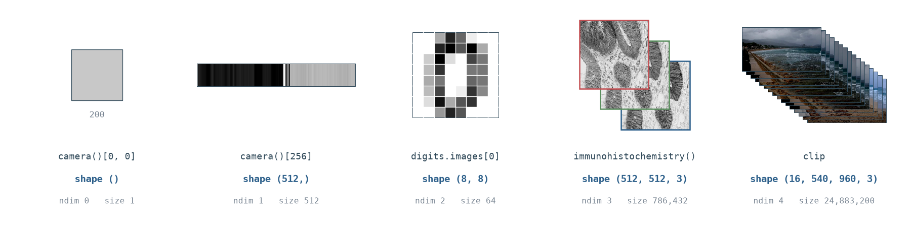
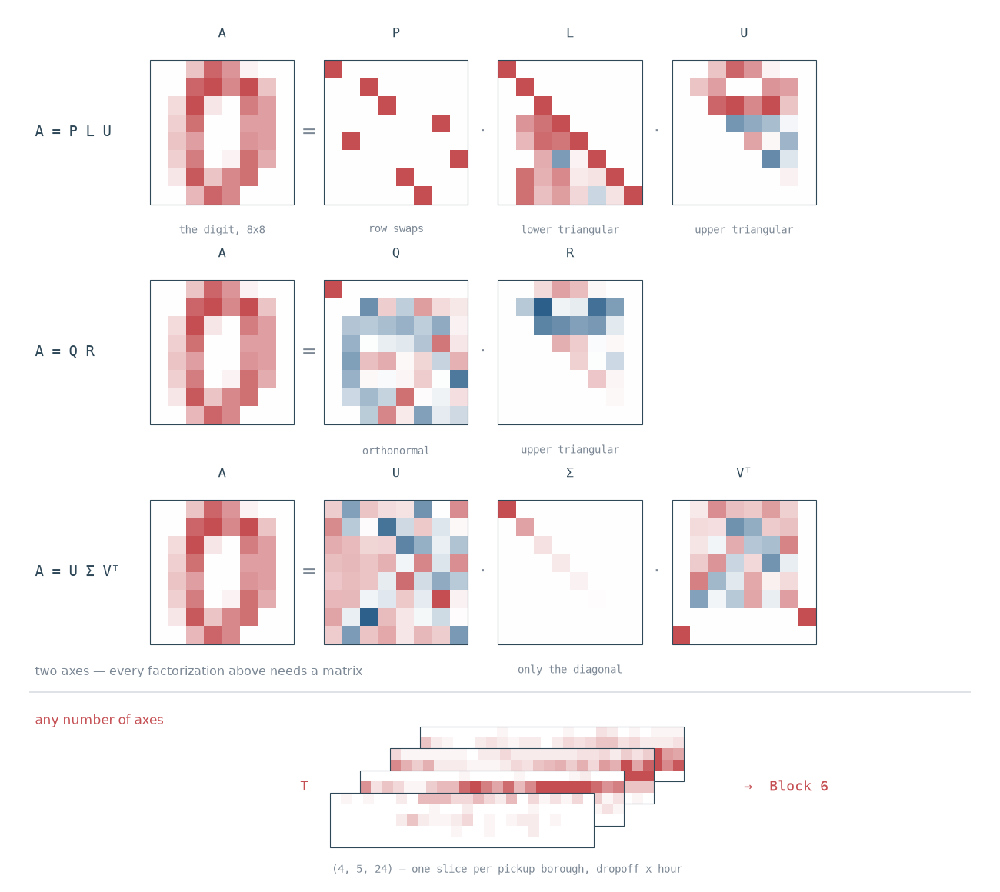
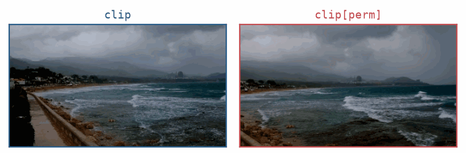
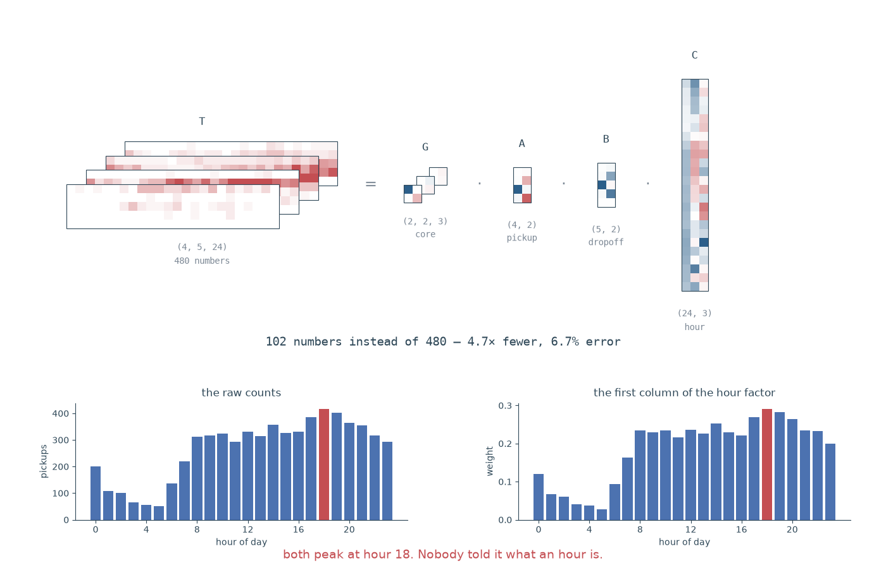

**🆕 Facilitator note on this edit.** Three 6-question Kahoot quizzes have been inserted as knowledge checks after Block 2, after Block 4, and after Block 6 (see the schedule and each insertion point below, marked 🆕). Running time increases from 180 to **195 minutes (3h15)**. If you need to hold the line at 180 minutes, see the cutting order in Appendix E, which now also covers the quizzes.

**Before you arrive:** you have read *[Deep Learning](https://www.deeplearningbook.org/contents/linear_algebra.html)* (Goodfellow, Bengio & Courville), **Chapter 2 — Linear Algebra**. You know matrices. This workshop assumes **no previous knowledge of tensor theory**.

**What you will learn:** what a tensor is, the vocabulary used to talk about them, how to manipulate them in NumPy, how to solve systems that have no exact solution, what convolution and deconvolution really are, how recursion works with matrices, and how to factorize tensors.

**How we work:** Notebooks on **GitHub**, run in **Colab**, discussion in **Discord**. Two rhythms:
- **Exercise blocks** — 10 minutes coding, then 5 minutes explanation.
- **Group block** (video pipeline design, Part III) — 10 minutes discussion in your breakout channel, then share-back.

**A note on language.** This workshop is taught in English, but many terms are nearly identical in Spanish: *tensor/tensor*, *matrix/matriz*, *axis/eje*, *dimension/dimensión*, *decomposition/descomposición*, *factorization/factorización*, *contraction/contracción*, *convolution/convolución*, *recursion/recursión*. Every new term is defined when it first appears. **Ask questions in Spanish or English** in the Discord threads — whichever lets you ask faster.

---

## The Data We Use

All data in this workshop is **real**. Nothing is invented with random numbers, because real data contains problems that random data never shows — missing values, features on incompatible scales, pixels that never change. Finding those problems is part of the work.

**Included inside the libraries** (no download, works offline):

| Dataset | What it is | Shape |
|---|---|---|
| `load_breast_cancer()` | 569 real patients, 30 measurements from tumour cell images | `(569, 30)` |
| `load_digits()` | 1797 real handwritten digits | `(1797, 8, 8)` |
| `data.camera()`, `data.astronaut()` | Real photographs | `(512, 512)`, `(512, 512, 3)` |
| `data.immunohistochemistry()`, `data.cell()` | Real histology and microscopy images | `(512, 512, 3)`, `(660, 550)` |

**Downloaded once at the start** (needs internet, takes a few seconds):

| Dataset | What it is | Used for |
|---|---|---|
| California Housing | 20,640 real housing districts from the 1990 US census | Pseudoinverse, least squares |
| NYC Taxi Trips | 6,433 real taxi journeys in New York | Tensor factorization |
| Airline Passengers | 144 months of real airline traffic, 1949–1960 | Recursion, forecasting |

**Run this first cell now.** If it fails, say so in Discord immediately.

```python
import numpy as np
import pandas as pd
from sklearn.datasets import load_digits, load_breast_cancer
from skimage import data
from scipy import signal
from scipy.linalg import lu, toeplitz

HOUSING = "https://raw.githubusercontent.com/ageron/handson-ml2/master/datasets/housing/housing.csv"
TAXIS   = "https://raw.githubusercontent.com/mwaskom/seaborn-data/master/taxis.csv"
FLIGHTS = "https://raw.githubusercontent.com/mwaskom/seaborn-data/master/flights.csv"

housing = pd.read_csv(HOUSING)
taxis   = pd.read_csv(TAXIS)
flights = pd.read_csv(FLIGHTS)
print(housing.shape, taxis.shape, flights.shape)   # (20640, 10) (6433, 14) (144, 3)
```

---

## Schedule (195 minutes, incl. 3 Kahoot checks)

| Part | Segment | Format | Time |
|---|---|---|---|
| — | Setup and welcome | — | 5 min |
| **I** | What a tensor is: theory and NumPy | demo | 20 min |
| **II** | Thinking in N dimensions | demo | 20 min |
| **III** | Block 1 — Indexing and broadcasting real data | exercise | 15 min |
| **III** | Block 2 — Reshape and transpose real images | exercise | 15 min |
| 🆕 — | **Kahoot Quiz 1 — Tensor Vocabulary & Shapes** | quiz | 5 min |
| — | Break | — | 5 min |
| **III** | Group exercise — Video pipeline design | group | 15 min |
| **IV** | Block 3 — Contraction with `einsum` | exercise | 15 min |
| — | Break | — | 5 min |
| **IV** | Block 4 — Inverses and the pseudoinverse | exercise | 15 min |
| 🆕 — | **Kahoot Quiz 2 — Einsum, Distance & the Pseudoinverse** | quiz | 5 min |
| **IV** | Recursion with matrices and vectors | demo | 10 min |
| **IV** | Block 5 — Convolution and deconvolution | exercise | 15 min |
| — | Break | — | 5 min |
| **IV** | Block 6 — Tucker decomposition on real data | exercise | 15 min |
| 🆕 — | **Kahoot Quiz 3 — Convolution & Tensor Decompositions** | quiz | 5 min |
| — | Wrap-up | — | 5 min |

**Why these three spots.** Each quiz sits right after the block(s) that supply its content, while the material is still fresh, and before the next context switch (a break or a new Part) — so it reinforces rather than interrupts. Quiz 1 closes out Part III's shape/vocabulary work; Quiz 2 closes out the einsum/pseudoinverse stretch of Part IV; Quiz 3 closes out the decomposition stretch of Part IV, right before the Wrap-up recap.

---

# PART I — What a Tensor Is (20 min)

## 1.1 Vocabulary

Keep this table open for the whole workshop.

| Term | Plain meaning | Spanish | Example |
|---|---|---|---|
| **Tensor** | An array of numbers with any number of axes | *tensor* | A colour image |
| **Axis** (pl. axes) | One direction along which data is arranged | *eje* | Height; width; colour |
| **Mode** | Another word for axis, used in tensor theory | *modo* | "mode-0 unfolding" |
| **Order** | How many axes a tensor has | *orden* | A matrix has order 2 |
| **Shape** | The size along each axis, as a tuple | *forma* | `(512, 512, 3)` |
| **Slice** | Fix one index, keep the rest | *corte* | One colour channel |
| **Fiber** | Fix every index except one | *fibra* | The 3 colour values of one pixel |
| **Unfolding** | Rearranging a tensor into a matrix | *desplegado* | Needed for decompositions |
| **Contraction** | Multiply and sum over a shared axis | *contracción* | The dot product |
| **Decomposition** | Writing one tensor as a product of simpler ones | *descomposición* | SVD, PCA, Tucker |

⚠️ **Warning about the word "rank".** In Chapter 2, *rank* means the number of independent columns of a matrix. In tensor theory, *rank* often means the number of axes. To avoid confusion, this workshop says **order** for the number of axes, and **rank** only in Chapter 2's sense.

## 1.2 Shape in NumPy

Every NumPy array has `.shape`, a tuple giving the size along each axis. The length of that tuple is `.ndim`, the number of axes.

```python
scalar = np.array(3.0)                     # book: a           — order 0
vector = np.array([1., 2., 3.])            # book: x, x_i      — order 1
matrix = np.array([[1., 2.], [3., 4.]])    # book: A, A_{i,j}  — order 2
tensor = np.random.randn(2, 3, 4)          # book: A_{i,j,k}   — order 3

for name, arr in [("scalar", scalar), ("vector", vector),
                  ("matrix", matrix), ("tensor", tensor)]:
    print(f"{name:8s} shape={str(arr.shape):12s} ndim={arr.ndim}  size={arr.size}")

# scalar   shape=()          ndim=0  size=1
# vector   shape=(3,)        ndim=1  size=3
# matrix   shape=(2, 2)      ndim=2  size=4
# tensor   shape=(2, 3, 4)   ndim=3  size=24
```

A scalar has `shape=()`, an empty tuple — there are no axes to measure. And `size` is always the product of the numbers in `shape`: 2 × 3 × 4 = 24.

Now with real data:

```python
digits = load_digits()
print(digits.images.shape)      # (1797, 8, 8)  — 1797 handwritten digits, 8x8 pixels

photo = data.immunohistochemistry()
print(photo.shape)               # (512, 512, 3) — height, width, colour
```

{.column-page fig-alt="Five real arrays in a row, climbing from order 0 to order 4: a single grey square holding one pixel of the camera photograph, a long thin strip holding one row of it, one handwritten digit as an eight-by-eight grid of grey squares with white gutters ruled between them, a stained histology photograph shown as three separated colour planes, and sixteen frames of a storm clip stacked in a pile. Each is labelled with its shape, ndim and size."}

*The same climb, in arrays you will meet today. `shape` grows by one number at each rung; the last two rungs both have a `3` in them, and the two threes mean nothing like each other.*

Both are order 3, but their axes mean completely different things. `digits.images` counts *images* along axis 0; `photo` counts *colours* along axis 2. **The shape alone never tells you what the axes mean.** You must know, and you must keep track.

## 1.3 The Three Operations That Matter

**Slices and fibers** — fixing indices takes a tensor apart.

```python
photo[:, :, 0].shape       # (512, 512) — a slice: one colour channel, still an image
photo[100, 200, :].shape   # (3,)       — a fiber: the 3 colour values of one pixel
```

**Unfolding** — every tensor decomposition begins by turning the tensor into a matrix, one axis at a time. Move axis *k* to the front, then flatten everything else into one long axis.

```python
def unfold(T, axis):
    return np.moveaxis(T, axis, 0).reshape(T.shape[axis], -1)

print(unfold(photo, 0).shape)   # (512, 1536) — rows are the height axis
print(unfold(photo, 2).shape)   # (3, 262144) — rows are the 3 colour channels
```

Unfolding **loses nothing**. It only rearranges. The mode-2 unfolding says "each colour channel is one row of 262,144 numbers" — and now every matrix tool you know, including SVD, can be applied to it.

**Contraction** — multiply along a shared axis and sum over it. The dot product (eq. 2.8) and the matrix product (eq. 2.5) are both contractions. `np.einsum` writes them directly:

```python
a = np.array([1., 2., 3.]); b = np.array([4., 5., 6.])
np.einsum('i,i->', a, b)          # dot product, sum over i          (eq 2.8)

A = np.array([[1., 2.], [3., 4.]]); B = np.array([[5., 6.], [7., 8.]])
np.einsum('ik,kj->ij', A, B)      # matrix product, sum over k       (eq 2.5)
```

**The rule, in one sentence:** an index that appears in the inputs but **not** after the arrow is summed over; an index that appears after the arrow is kept.

## 1.4 The Map of Factorizations

A **factorization** writes one object as a product of simpler objects. You met two in Chapter 2. Here is the whole family we will use today:

| Method | Works on | What it gives you | Where today |
|---|---|---|---|
| **LU** | Square matrix | Gaussian elimination, saved for reuse | Below |
| **QR / Gram-Schmidt** | Any matrix | Perpendicular, unit-length directions | Below |
| **Eigendecomposition** | Square matrix | Directions that only get scaled (§2.7) | Recursion demo |
| **SVD** | Any matrix | The most general matrix factorization (§2.8) | Blocks 4 and 6 |
| **PCA** | Data matrix | Compression to fewer features (§2.12) | Take-home A |
| **Pseudoinverse** | Any matrix | "Inverse" when no true inverse exists (§2.9) | Block 4 |
| **Cholesky** | Symmetric positive-definite matrix | A "square root" of a covariance matrix, for *building* correlated data | Appendix D |
| **Tucker / CP** | **Tensor, any order** | PCA generalized to every axis | Block 6 |

```python
A = np.array([[4., 3., 2.], [2., 1., 1.], [6., 3., 5.]])

P, L, U = lu(A)                            # LU: A = P L U
print(np.allclose(P @ L @ U, A))            # True

Q, R = np.linalg.qr(A)                      # QR: orthonormal directions
print(np.allclose(Q.T @ Q, np.eye(3)))      # True — book eq 2.37
```

**LU** is Gaussian elimination stored as two triangular matrices, so `Ax = b` can be solved cheaply many times for different `b`. **QR** (computed by Gram-Schmidt, or more stably by other methods) produces *orthonormal* directions — mutually perpendicular, each of length 1. It is used for orthogonal weight initialization in neural networks and for stable least-squares.

{.column-page fig-alt="One eight-by-eight handwritten digit factorized three ways, each row showing the original matrix and its factors as small heatmaps: A equals P times L times U, with L visibly lower triangular and U upper triangular; A equals Q times R; and A equals U times Sigma times V transpose, with Sigma empty apart from its diagonal. Below a dividing line, a pile of four slices of the real taxi tensor, labelled as having any number of axes, pointing to Block 6."}

*The same 8×8 digit, factorized three ways. The shapes are the point: `L` really is lower triangular, `U` upper, and `Σ` is empty apart from its diagonal. Below the line is an object none of them can touch.*

Everything in that table above the double line works on **matrices** — two axes. Real data often has more. That is what Block 6 addresses.

---

# PART II — Thinking in N Dimensions (20 min)

A live coding demo in the notebook, on real image and video tensors. Open it in Colab and run the Setup cell first — it downloads and checksums the real video clip used by the exercises. Three exercises:

1. **Read the axes on real tensors.** `digits.images` is `(1797, 8, 8)` and a photo is `(512, 512, 3)` — both order 3, but axis 0 counts whole images in one and rows of pixels in the other. `digit_batch` and `video_patch` are *both* `(8, 8, 8)`. Before running anything, say what every axis counts.
2. **Shuffle a batch vs shuffle time.** Shuffling axis 0 is harmless for a batch — examples are independent, order carries no information — and destroys a video, where order **is** the information. The same operation, a completely different meaning. Chapter 2's notation has no concept of "order matters between elements." That is genuinely new today.
3. **Batch clips of different lengths.** Real videos have different frame counts, but a batch tensor is rectangular. Take three real clips of length 4, 7 and 5, pad them into one `(3, 7, 135, 240, 3)` order-5 batch, and carry a Boolean `(3, 7)` validity mask so `valid.sum() == 16` — the padding stays visible instead of being averaged into the data.

---

# PART III — Working With Tensor Axes

## Block 1 — Indexing and Broadcasting Real Data (15 min)

**Why this matters.** The `breast_cancer` data holds 30 real measurements of tumour cell nuclei for 569 real patients. Selecting the wrong column does not produce an error — it returns a *different real measurement*, and your analysis continues and gives a confident, wrong answer. In research this produces results nobody can reproduce. In a clinical tool it produces a wrong recommendation about a real person.

**In tech**, the identical operation runs on a `(users, items)` matrix to pull one user's history before making a recommendation.

**Exercise (10 min)**
```python
bc = load_breast_cancer()
X, y = bc.data, bc.target          # (569, 30); y: 0 = malignant, 1 = benign
names = list(bc.feature_names)

# TODO 1: Print X.shape. Say out loud what each axis means.
# TODO 2: Extract the column "mean radius" for all patients -> shape (569,).
#         Find its position with names.index(...). Do not hard-code a number.
# TODO 3: Find the 5 patients with the LARGEST mean radius, then extract their
#         full 30-measurement profiles as one (5, 30) array, in ONE operation.
# TODO 4: Using boolean indexing, compare mean radius for malignant (y == 0)
#         against benign (y == 1) patients. Is there a real difference?

# --- broadcasting, on real images ---
images = load_digits().images          # (1797, 8, 8)
D = images.reshape(len(images), -1)    # (1797, 64)

# TODO 5: Compute the mean and std of each of the 64 pixels across all images.
# TODO 6: Standardize with broadcasting: (D - mean) / std.
#         RUN IT AND LOOK AT THE RESULT before continuing.
# TODO 7: You will find NaN. How many pixels have std == 0, and why would a real
#         handwritten digit image contain such pixels? Fix it, then verify no NaN.
```

**Explanation (5 min)**
```python
i = names.index("mean radius")
radius = X[:, i]                                   # book notation A_{:,j}
top5 = np.argsort(radius)[-5:]
profiles = X[top5, :]                               # (5, 30)
print(radius[y == 0].mean(), radius[y == 1].mean()) # 17.5 vs 12.1

mean, std = D.mean(axis=0), D.std(axis=0)
print((std == 0).sum())                             # 3
Z = (D - mean) / np.where(std == 0, 1.0, std)
```

Two real results. **Malignant tumours really do have a larger mean radius** — 17.5 against 12.1. And **three pixels are always dark in all 1797 digit images**: they sit in corners where nobody writes. Their standard deviation is exactly zero, so dividing produces NaN. Random data would never have shown you this.

## Block 2 — Reshape and Transpose Real Images (15 min)

**Why this matters.** Microscopes and cameras order their axes according to the hardware, not according to what a model expects. Getting this wrong does not crash — the model runs on scrambled data and returns confident, meaningless output. In a drug screen, that is a wrong decision about whether a compound works. The famous version in tech: a model trained in TensorFlow (`NHWC`) deployed into PyTorch (`NCHW`) with no transpose.

**Exercise (10 min)**
```python
photo = data.immunohistochemistry()   # (512, 512, 3) real histology
cells = data.cell()                    # (660, 550)    real microscopy, grayscale

# TODO 1: Print both shapes. Which one has no colour axis?
# TODO 2: Convert `photo` from (H, W, C) to (C, H, W) with np.transpose.
# TODO 3: Stack `photo` three times into a batch of shape (3, 512, 512, 3).
#         Which axis is the batch axis?
# TODO 4: Convert that batch from NHWC to NCHW -> (3, 3, 512, 512).
#         Two axes now both have size 3. How do you know which is which?
# TODO 5: photo.reshape(3, 512, 512) runs WITHOUT error but is wrong.
#         Run it, compare against TODO 2, and explain the difference.
```

**Explanation (5 min)**
```python
chw   = np.transpose(photo, (2, 0, 1))      # (3, 512, 512) — correct
batch = np.stack([photo, photo, photo])      # (3, 512, 512, 3)
nchw  = np.transpose(batch, (0, 3, 1, 2))    # (3, 3, 512, 512)
wrong = photo.reshape(3, 512, 512)           # runs, but scrambles the image
```

**Reshape only reinterprets numbers in memory order. Transpose moves them according to axis meaning.** Both give shape `(3, 512, 512)`; only one is the image. And TODO 4 makes the deeper point: once two axes share a size, the shape cannot tell you which is which. Only your own tracking can.

## 🆕 Kahoot Quiz 1 — Tensor Vocabulary & Shapes (5 min)

**Run this before the break, right after Block 2.** Everyone has just used order, axis, shape, slice, fiber, variance, reshape, and transpose — this is the moment those words are freshest. Launch `kahoot_quiz_1_vocabulary_shapes.xlsx` (6 questions, ~5 min including the podium). No prep needed beyond having it imported into a kahoot ahead of time.

## Break (5 min)

## Group Exercise — Video Pipeline Design (15 min)

Back to your breakout channel. 10 minutes design, 5 minutes share-back. There is no single correct answer.

> Design the tensor shape at each stage — *raw file → decoded frames → preprocessed batch → model input → model output* — for **both** systems:
> - **Tech:** a short-video app computing one embedding per video from sampled frames, to choose what to play next.
> - **Biotech:** a surgical-video model that labels the current phase of an operation from an operating-room camera.

{.column-page fig-alt="Two video panes side by side, both cycling through the same eight frames of a storm at a rocky shore. The left pane, labelled clip, plays them in order and the swell builds steadily. The right pane, labelled clip permuted, plays the identical frames in a shuffled order and the sea jumps between shots."}

*Both panes hold the same eight frames, the same shape and the same sum. Only the order of axis 0 differs, and no arithmetic in this workshop can tell you which one is the video.*

1. Sketch the shape at each of the five stages, for both. Where are they the same, and where must they differ?
2. Clips have different lengths — 30 seconds against 4 hours. Take the padding-and-mask strategy from Part II and give the exact shape of the preprocessed batch. What does an invented or wasted value in that tensor represent?
3. The surgical system adds **three camera angles** recording at once. Where does that axis go, and why does its position change how easy the rest of the pipeline is to write?
4. The recommender samples 8 frames out of 900. Which operation from Block 1 does that, and what is lost?
5. Both systems must decide **which frames matter most**. What kind of mechanism could learn that weighting?

---

# PART IV — Computing With Tensors

## Block 3 — Contraction With `einsum` (15 min)

**Why this matters.** Recommendation and search systems rank items by the dot product between a user vector and every item vector — one user against millions of items, many times per second. That contraction *is* the ranking signal. Sum over the wrong axis and every user gets wrong results.

**Exercise (10 min)**
```python
photo = data.immunohistochemistry().astype(float)        # (512, 512, 3)
batch = np.stack([photo, data.astronaut().astype(float)]) # (2, 512, 512, 3)
w = np.array([0.2125, 0.7154, 0.0721])                    # RGB -> grayscale weights

# TODO 1: With einsum, convert `photo` to grayscale by contracting the colour
#         axis against w. Result shape (512, 512).
# TODO 2: Do the same for the whole batch in ONE einsum call -> (2, 512, 512).
# TODO 3: Write these Chapter 2 operations as einsum and check each against NumPy:
#           (a) trace          (eq 2.48)
#           (b) transpose      (eq 2.3)
#           (c) matrix product (eq 2.5)
# TODO 4: Flatten the digits to (1797, 64) and compute the (1797, 1797) similarity
#         matrix between every pair of digit images with one einsum.
```

**Explanation (5 min)**
```python
gray       = np.einsum('hwc,c->hw',   photo, w)     # (512, 512)
gray_batch = np.einsum('nhwc,c->nhw', batch, w)      # (2, 512, 512)

np.einsum('ii->', A)           # trace          == np.trace(A)
np.einsum('ij->ji', A)         # transpose      == A.T
np.einsum('ik,kj->ij', A, B)   # matrix product == A @ B
```

`c` appears in the inputs but not after the arrow, so it is **summed over** — that is the contraction. `n`, `h`, `w` appear after the arrow, so they are **kept**. Adding a batch axis costs exactly one letter. This is why `einsum` is worth learning: the same expression works for one image or for a million, and it reads like the mathematics in Chapter 2.

## Block 4 — Inverses and the Pseudoinverse (15 min)

### The theory, in three steps

**Step 1 — square matrices.** Chapter 2 §2.3 defines `A⁻¹` for a square matrix, with `A⁻¹A = I`. But this only exists when the columns are linearly independent. A matrix with dependent columns is **singular** and has no inverse:

```python
S = np.array([[2., 1.], [1., 3.]])
np.linalg.inv(S) @ S                       # ≈ identity, fine

Singular = np.array([[1., 2.], [2., 4.]])  # column 2 = 2 × column 1
np.linalg.inv(Singular)                     # raises LinAlgError
```

**Step 2 — non-square matrices.** `A⁻¹` is not even defined. But we still need to solve `Ax = b`, and in machine learning `A` is almost never square: it has one row per example and one column per feature, and there are always far more examples than features.

The **Moore-Penrose pseudoinverse** `A⁺` (Chapter 2 §2.9) is the answer. It is defined for *every* matrix — square or not, singular or not — and it is computed from the SVD (eq. 2.47):

```python
A = np.random.randn(5, 3)
A_plus = np.linalg.pinv(A)
print(A.shape, A_plus.shape)               # (5, 3) (3, 5) — note the shape flips

U, S_, Vt = np.linalg.svd(A, full_matrices=False)
print(np.allclose(A_plus, Vt.T @ np.diag(1/S_) @ U.T))   # True — this is eq 2.47
```

It satisfies four conditions that define it uniquely — all verified to be `True`:

```python
np.allclose(A @ A_plus @ A, A)            # 1
np.allclose(A_plus @ A @ A_plus, A_plus)  # 2
np.allclose((A @ A_plus).T, A @ A_plus)   # 3
np.allclose((A_plus @ A).T, A_plus @ A)   # 4
```

What `A⁺` gives you depends on the shape, exactly as Chapter 2 §2.9 says:
- **More rows than columns** (too many equations, usually no exact solution) → `x = A⁺b` gives the `x` that makes `Ax` as **close as possible** to `b`. This is least squares.
- **More columns than rows** (too few equations, infinitely many solutions) → `x = A⁺b` gives the valid solution with the **smallest norm**.

**Step 3 — what about tensors?** This is a fair question with an honest answer. There is no single tensor inverse that everyone uses. Several definitions exist (based on the Einstein product, or the t-product for order-3 tensors), and they are active research. **In practice, in machine learning, you unfold the tensor into a matrix, use the matrix pseudoinverse, and fold the result back.** That works because unfolding loses nothing:

```python
T = np.random.randn(4, 3, 5)
M = unfold(T, 0)                       # (4, 15)
M_plus = np.linalg.pinv(M)             # (15, 4)
np.allclose(M @ M_plus @ M, M)          # True
```

This is a general lesson worth remembering: **when a tensor problem is hard, unfold it to a matrix, solve it there, and fold back.**

**Exercise (10 min)** — real California housing data.
```python
# Predict house value from district features. 20,640 real districts.
print(housing.shape)                                   # (20640, 10)
print(housing['total_bedrooms'].isnull().sum())         # 207 missing values!

# TODO 1: Drop rows with missing values. How many rows remain?
# TODO 2: Build X from these columns, and add a column of ones for the bias:
#         ['housing_median_age','total_rooms','total_bedrooms',
#          'population','households','median_income']
#         Target y = 'median_house_value'. Print X.shape. Is X square?
# TODO 3: Try np.linalg.inv(X). What happens, and why?
# TODO 4: Solve for the weights with the pseudoinverse: w = pinv(X) @ y.
# TODO 5: Check your answer against np.linalg.lstsq. Do they agree?
# TODO 6: Compute the RMSE of the predictions. Which feature has the largest
#         coefficient, and does that make sense for house prices?
```

**Explanation (5 min)**
```python
d = housing.dropna()                                     # 20433 rows remain
feats = ['housing_median_age','total_rooms','total_bedrooms',
         'population','households','median_income']
X = np.column_stack([np.ones(len(d)), d[feats].to_numpy(float)])   # (20433, 7)
y = d['median_house_value'].to_numpy(float)

w = np.linalg.pinv(X) @ y
w_lstsq, *_ = np.linalg.lstsq(X, y, rcond=None)
np.allclose(w, w_lstsq)                                   # True

rmse = np.sqrt(((X @ w - y) ** 2).mean())                 # ≈ 75,980
```

`X` is 20433 × 7 — very tall, so `np.linalg.inv` cannot even be called. There is **no exact solution**: no straight line passes through 20,433 points. The pseudoinverse gives the best possible answer instead, and `lstsq` agrees exactly because it solves the same problem. The largest coefficient belongs to `median_income` (about 47,700 per unit), which is the sensible result — income predicts house prices.

## 🆕 Kahoot Quiz 2 — Einsum, Distance & the Pseudoinverse (5 min)

**Run this right after Block 4, before the recursion demo.** It covers contraction (Block 3's `einsum`), the pseudoinverse and singular matrices (Block 4), and distance/similarity — the digit-similarity matrix from Block 3 TODO 4 is the natural bridge between the two. Launch `kahoot_quiz_2_distance_pseudoinverse.xlsx` (6 questions, ~5 min).

## Recursion With Matrices and Vectors (10 min — demo)

**Recursion** means defining something in terms of itself. With matrices this becomes: apply the same matrix again and again. Three examples, increasing in usefulness.

**1. Fibonacci as repeated matrix multiplication.** The rule `f(n) = f(n-1) + f(n-2)` is one matrix applied repeatedly:

```python
F = np.array([[1, 1], [1, 0]])
v = np.array([1, 0])
for _ in range(10):
    v = F @ v
print(v[1])                                  # 55
print(np.linalg.matrix_power(F, 10)[0, 1])   # 55 — same answer, one step
```

**2. Power iteration — recursion that finds an eigenvector.** Multiply any starting vector by `A` repeatedly, rescaling each time. It converges to the eigenvector with the largest eigenvalue (Chapter 2 §2.7):

```python
A = np.array([[4., 1.], [2., 3.]])
x = np.random.randn(2); x /= np.linalg.norm(x)
for _ in range(50):
    x = A @ x
    x /= np.linalg.norm(x)

print(x @ A @ x)                    # 5.000000
print(np.linalg.eig(A)[0].max())    # 5.000000 — identical
```

This is how PageRank ranks web pages, and it is why eigenvectors matter far beyond Chapter 2: **repeated application of a matrix converges to its dominant eigenvector.**

**3. Recursion on real data — forecasting airline traffic.** This combines recursion with the pseudoinverse from Block 4. We fit a model that predicts each month from the previous 12, then apply it *to its own output* to forecast forward:

```python
y = flights['passengers'].to_numpy(float)     # 144 real months, 1949–1960
p = 12
rows = np.array([y[i:i+p] for i in range(len(y) - p)])
X = np.column_stack([np.ones(len(rows)), rows])
w = np.linalg.pinv(X) @ y[p:]                  # least squares, exactly as in Block 4

history = list(y[-p:])
for _ in range(12):                             # recursion: feed predictions back in
    nxt = w[0] + np.dot(w[1:], history[-p:])
    history.append(nxt)

print(np.round(history[-12:], 1))
# [465.2 429.1 455.1 491.0 527.8 589.4 679.7 661.3 575.3 509.5 438.6 470.7]
```

The forecast reproduces the seasonal shape of real air travel — low in winter, peaking in summer — because the model learned it from 132 real training windows. **This is exactly the structure of a recurrent neural network**: a hidden state, updated by the same weights at every step.

```python
W, U = np.random.randn(4, 4) * 0.5, np.random.randn(4, 3) * 0.5
h = np.zeros(4)
for t in range(6):
    h = np.tanh(W @ h + U @ xs[t])    # same W and U every step — that is the recursion
```

## Block 5 — Convolution and Deconvolution (15 min)

### The theory

**Convolution** slides a small array (the **kernel**, or **filter**) across a larger one, multiplying and summing at each position. It is the operation at the heart of every convolutional neural network, and it is also how every blur, sharpen, and edge-detection filter works.

```python
x = np.array([1., 2., 3., 4., 5.])
k = np.array([1., 0., -1.])

np.convolve(x, k, 'full')    # [ 1.  2.  2.  2.  2. -4. -5.]  length 5+3-1 = 7
np.convolve(x, k, 'valid')   # [ 2.  2.  2.]                  length 5-3+1 = 3
np.convolve(x, k, 'same')    # [ 2.  2.  2.  2. -4.]          length 5
```

Three modes, three output sizes. `valid` uses only positions where the kernel fits completely — this is why convolution **shrinks** an image by `kernel_size - 1`.

⚠️ **A detail that confuses everyone.** True convolution flips the kernel; **correlation** does not. What deep learning libraries call "convolution" is actually correlation. It makes no practical difference, because the network *learns* the kernel — but you should know the names are inconsistent.

```python
np.correlate(x, k, 'valid')          # [-2. -2. -2.]
np.convolve(x, k[::-1], 'valid')     # [-2. -2. -2.] — the same, with k flipped
```

**Convolution is a matrix multiplication.** This is the connection back to Chapter 2. Any convolution can be written as multiplication by a **Toeplitz** matrix — a matrix where the kernel is shifted along each row:

```python
col = np.zeros(7); col[:3] = k
row = np.zeros(5); row[0] = k[0]
C = toeplitz(col, row)                       # (7, 5)
np.allclose(C @ x, np.convolve(x, k, 'full'))   # True
```

So convolution is not a new kind of operation. It is a **structured matrix multiplication** — one where the same few numbers are reused across the whole matrix. That reuse is exactly why CNNs need so many fewer parameters than fully connected networks.

**Deconvolution** means two different things, and you must keep them separate:

1. **Transposed convolution** — the upsampling layer in a decoder or GAN. It makes things *bigger*. It is not a true inverse; the name is historical and misleading.
2. **True deconvolution** — recovering the original signal from a blurred one. This is a genuine inverse problem, and it is where Block 4 comes back.

**Exercise (10 min)**
```python
img = data.camera().astype(float) / 255.      # real photograph, 512x512
sobel = np.array([[-1,0,1],[-2,0,2],[-1,0,1]], float)

# TODO 1: Convolve `img` with `sobel` in 'valid' mode. What shape comes out,
#         and by how much did it shrink?
# TODO 2: Blur the image with a 9x9 averaging kernel (all entries equal,
#         summing to 1), mode='same'. Display it next to the original.
# TODO 3 (transposed convolution): upsample this 2x2 array to 3x3 by adding
#         small * kernel into an output array at each position:
#             small = np.array([[1., 2.], [3., 4.]]); ker = np.ones((2, 2))
#         What shape do you get? Why is this called "deconvolution" in CNNs
#         even though it does not undo anything?
# TODO 4 (true deconvolution): add small noise to the blurred image, then try to
#         recover the original with skimage.restoration.richardson_lucy(...,
#         num_iter=50). Measure error BEFORE and AFTER, ignoring a 25-pixel
#         border. Did it improve?
```

**Explanation (5 min)**
```python
edges = signal.convolve2d(img, sobel, mode='valid')     # (510, 510) — shrank by 2

psf = np.ones((9, 9)); psf /= psf.sum()
blurred = signal.convolve2d(img, psf, mode='same', boundary='symm')
noisy = blurred + 0.002 * np.random.default_rng(0).standard_normal(blurred.shape)

from skimage.restoration import richardson_lucy
recovered = richardson_lucy(np.clip(noisy, 0, 1), psf, num_iter=50)

c = 25   # ignore the border: deconvolution always creates edge artifacts
err = lambda a: np.linalg.norm((a-img)[c:-c,c:-c]) / np.linalg.norm(img[c:-c,c:-c])
print(err(noisy), err(recovered))     # 0.1157 -> 0.0815
```

Deconvolution **reduced the error by about 30%**. Two lessons worth keeping:

**First, you must ignore the border.** Deconvolution creates strong artifacts at the edges, where the algorithm has no information about what lies outside the image. If you measure error over the whole image, the artifacts dominate and it looks like the method failed. It did not.

**Second, why not just invert the blur directly?** Because it fails badly. Blurring destroys high-frequency detail, so inverting it divides by numbers very close to zero and amplifies noise enormously:

```python
K = np.fft.fft2(psf, s=img.shape)
naive = np.real(np.fft.ifft2(np.fft.fft2(noisy) / np.where(abs(K) < 1e-3, 1e-3, K)))
# relative error ≈ 1.4 — far WORSE than the blurred image we started from
```

**This is the same lesson as Block 4.** A direct inverse either does not exist or is unusable, so you use a method that finds the best stable answer instead. The pseudoinverse does this for linear systems; Richardson-Lucy and Wiener filtering do it for deconvolution. In biotech this is routine: every fluorescence microscope blurs its images by a known amount (the *point spread function*), and deconvolution is standard practice before cells are counted or measured.

## Break (5 min)

## Block 6 — Tucker Decomposition on Real Data (15 min)

### The theory

PCA compresses a **matrix** — two axes. Real data often has more. **Tucker decomposition** generalizes PCA to a tensor of any order: one **factor matrix per axis**, plus a small **core tensor** describing how the factors combine.

The way to compute it, called **HOSVD**, uses only tools you already have:
1. Unfold the tensor along each axis (Part I).
2. Run SVD on each unfolding; keep the top components. These are the factor matrices.
3. Contract the original tensor against all factor matrices to get the core (Block 3).

The related **CP decomposition** instead writes the tensor as a sum of simple rank-1 pieces. Tucker is usually more accurate at the same size; CP is often easier to interpret.

**Our real tensor.** From 6,433 real New York taxi trips we build a genuine order-3 tensor: **pickup borough × dropoff borough × hour of day.**

**Exercise (10 min)**
```python
taxis['hour'] = pd.to_datetime(taxis['pickup']).dt.hour
sub = taxis.dropna(subset=['pickup_borough', 'dropoff_borough'])
pb = sorted(sub['pickup_borough'].unique())
db = sorted(sub['dropoff_borough'].unique())

T = np.zeros((len(pb), len(db), 24))
for (p, d, h), v in sub.groupby(['pickup_borough','dropoff_borough','hour']).size().items():
    T[pb.index(p), db.index(d), h] = v

# TODO 1: Print T.shape and T.sum(). What does the entry T[i, j, k] mean?
# TODO 2: Which hour has the most trips overall? (Sum over the first two axes.)
# TODO 3: Unfold T along each axis and print the three shapes. Confirm the total
#         number of entries is the same each time — unfolding loses nothing.
# TODO 4: Run SVD on each unfolding, keep the top (2, 2, 3) components, and build
#         the core tensor with ONE einsum call.
# TODO 5: Reconstruct T from the core and factors, again with one einsum.
#         Compute the relative error and the compression ratio.
# TODO 6: Look at the first column of the hour factor matrix. At which hour is it
#         largest? Does that match what you found in TODO 2?
```

**Explanation (5 min)**
```python
Us = [np.linalg.svd(unfold(T, ax), full_matrices=False)[0] for ax in range(3)]
r = (2, 2, 3)
Us = [Us[i][:, :r[i]] for i in range(3)]

core  = np.einsum('ijk,ia,jb,kc->abc', T, Us[0], Us[1], Us[2])   # (2, 2, 3)
recon = np.einsum('abc,ia,jb,kc->ijk', core, Us[0], Us[1], Us[2])

error = np.linalg.norm(T - recon) / np.linalg.norm(T)            # 0.067
ratio = T.size / (core.size + sum(u.size for u in Us))            # 4.71
```

{.column-page fig-alt="The taxi tensor decomposed. Along the top, T as a pile of four heatmap slices equals a small core G times three factor matrices A, B and C, each labelled with its shape. Below, two bar charts against hour of day: the raw pickup counts, and the first column of the hour factor. Both have their tallest bar at hour 18, drawn in red."}

*480 numbers become 102. The two charts are TODO 6: the busiest hour in the raw counts, and the peak of the hour factor the decomposition built without ever being told what an hour is.*

**The result: 4.7× fewer numbers, 6.7% error.** But the important part is TODO 6. The strongest pattern in the hour factor peaks at **hour 18** — and that is also the busiest hour in the raw data. **The decomposition discovered evening rush hour by itself.** Nobody told it about time, traffic, or commuting; it found the dominant pattern along that axis because that is what a decomposition does.

Look at the einsum strings: `'ijk,ia,jb,kc->abc'` contracts three axes in one expression. That is why `einsum` came first.

**Where this is used.** In tech, Tucker and CP compress the large weight tensors inside neural networks so models run on phones instead of servers. In biotech, applied to data such as (genes × samples × conditions), they find structure ordinary PCA cannot reach, because PCA can only ever see two axes. For real projects use [`tensorly`](https://tensorly.org), which implements both properly — see [Further Reading](#tensors-specifically) for the Kolda & Bader survey and the theorem (Eckart–Young) underneath both decompositions.

---

## 🆕 Kahoot Quiz 3 — Convolution & Tensor Decompositions (5 min)

**Run this right after Block 6, before the Wrap-up.** It covers convolution/correlation (Block 5) and Tucker/CP decomposition (Block 6) while the taxi-tensor rush-hour result is still on screen. Launch `kahoot_quiz_3_convolution_decompositions.xlsx` (6 questions, ~5 min). This also doubles as a live rehearsal of the Wrap-up's own recap, so segue straight from the quiz into it.

---

## Wrap-Up (5 min)

What you did today:

1. **Part I** — learned the vocabulary of tensors (axis, order, shape, slice, fiber, unfolding, contraction, decomposition), and that unfolding turns any tensor into a matrix without losing anything.
2. **Part II** — worked through what axes mean and why batch and time axes are semantically different.
3. **Part III** — indexed, broadcast, reshaped and transposed real tumour data and real medical images, and hit real problems: zero-variance pixels, and reshape silently destroying an image.
4. **Part IV** — wrote contractions with `einsum`; solved an unsolvable 20,433-equation system with the pseudoinverse; used recursion to forecast real airline traffic and to find an eigenvector; convolved and deconvolved a real photograph; and compressed a real taxi tensor 4.7× with Tucker, which found rush hour on its own.

**One idea connects Blocks 4, 5 and 6:** when a problem has no exact answer or no true inverse, you do not give up — you find the best stable approximation. The pseudoinverse does this for linear systems, Richardson-Lucy for blurred images, and Tucker for tensors that are too large to keep in full.

**Where to go next**
- `torch.einsum` / `tf.einsum` / `jnp.einsum` — identical syntax to what you used today.
- `np.linalg` — the rest of Chapter 2: eigendecomposition, `lstsq`, `pinv`, `qr`, `cholesky`.
- `scipy.signal` and `skimage.restoration` — convolution and deconvolution beyond today.
- The take-home notebooks below.
- **[Further Reading](#further-reading)** — books, the seminal Tucker/CP/SVD papers, and `tensorly`, for going deeper than today's 195 minutes.

---

## Further Reading

[Chapter 2](https://www.deeplearningbook.org/contents/linear_algebra.html) of *Deep Learning* (Goodfellow, Bengio & Courville) is the spine for the linear algebra above, but it doesn't cover Tucker or CP at all. This is where to go next.

### Linear algebra, to go deeper

- Strang, G. — *[Introduction to Linear Algebra](https://math.mit.edu/~gs/linearalgebra/)* — the accessible one. [Author's page](https://math.mit.edu/~gs/).
- Trefethen, L. N. & Bau, D. — *[Numerical Linear Algebra](https://people.maths.ox.ac.uk/trefethen/text.html)* — the one that takes SVD seriously. [Trefethen's page](https://people.maths.ox.ac.uk/trefethen/).
- Golub, G. H. & Van Loan, C. F. — *[Matrix Computations](https://www.press.jhu.edu/books/title/10678/matrix-computations)* — the reference, for when something is numerically wrong. [Golub biography](https://mathshistory.st-andrews.ac.uk/Biographies/Golub/) · [Van Loan's page](https://as.cornell.edu/people/charles-van-loan).

### Tensors specifically

- Kolda, T. G. & Bader, B. W. (2009). [*Tensor Decompositions and Applications*](https://doi.org/10.1137/07070111X), SIAM Review 51(3), 455–500 — the survey. If you read one thing after this workshop, it is this. [Kolda's page](https://www.mathsci.ai/) · [Bader's publications](https://scholar.google.com/citations?user=OJQ8pq0AAAAJ).
- Tucker, L. R. (1966). [*Some mathematical notes on three-mode factor analysis*](https://doi.org/10.1007/BF02289464), Psychometrika 31, 279–311 — Block 6's decomposition, from the source.
- Carroll, J. D. & Chang, J.-J. (1970). [*Analysis of individual differences in multidimensional scaling via an N-way generalization of "Eckart-Young" decomposition*](https://doi.org/10.1007/BF02310791), Psychometrika 35, 283–319, and Harshman, R. A. (1970). [*Foundations of the PARAFAC procedure*](https://www.psychology.uwo.ca/faculty/harshman/wpppfac0.pdf), UCLA Working Papers in Phonetics 16, 1–84 — CP/PARAFAC, discovered independently and twice: Carroll & Chang arrived at it as a generalization of Eckart–Young, Harshman from psychometrics, and called it PARAFAC. [Harshman's page](https://psychology.uwo.ca/faculty/harshman/).
- Eckart, C. & Young, G. (1936). [*The approximation of one matrix by another of lower rank*](https://doi.org/10.1007/BF02288367), Psychometrika 1, 211–218 — the truncated SVD is the optimal low-rank approximation. This is the theorem underneath Tucker and CP both.

### Software

- [`tensorly`](https://tensorly.org) docs — [Tucker](https://tensorly.org/stable/modules/generated/tensorly.decomposition.tucker.html) and [CP](https://tensorly.org/dev/modules/generated/tensorly.decomposition.CP.html) implementations, used in Block 6 and Appendix C. Created by [Jean Kossaifi](https://jeankossaifi.com/).

---

## Appendix A — Take-Home: How Many Principal Components Are Enough?

Real data contains a trap here. Find it.

```python
bc = load_breast_cancer(); X, y = bc.data, bc.target

# TODO 1: Center X, run np.linalg.svd, and compute the fraction of variance each
#         component explains (variance is proportional to S**2).
# TODO 2: How many components explain 95% of the variance? The answer will look
#         TOO GOOD. Do not trust it yet.
# TODO 3: Print X.var(axis=0). The 30 measurements use different units — some are
#         areas in the thousands, some are ratios below 1. What is that doing?
# TODO 4: Redo everything on standardized data: (X - mean) / std. How many now?
# TODO 5: Scatter-plot the first 2 components, coloured by y. Do the two groups separate?
```

<details><summary>Solution</summary>

```python
Xc = X - X.mean(axis=0)
S = np.linalg.svd(Xc, full_matrices=False)[1]
n95 = np.argmax(np.cumsum(S**2/(S**2).sum()) >= 0.95) + 1      # 1  (!)

Xs = (X - X.mean(axis=0)) / X.std(axis=0)
S2 = np.linalg.svd(Xs, full_matrices=False)[1]
n95_scaled = np.argmax(np.cumsum(S2**2/(S2**2).sum()) >= 0.95) + 1   # 10
```
Without standardizing, the first component appears to explain **98.2%** of the variance. It is an illusion: `worst area` has a variance around 323,000 while smoothness values sit below 1, so PCA reports the largest *unit*, not the largest *pattern*. After standardizing, the first component explains 44% and **10 components** are needed. **PCA knows nothing about units. Features on different scales must be standardized first.**
</details>

## Appendix B — Take-Home: Attention Is Two Contractions

Attention is the mechanism that answers question 5 from the video-pipeline discussion: *which parts of a sequence matter most?* Protein language models use it so every amino acid can look at every other one; recommenders use it to weight a user's past interactions.

```python
np.random.seed(6)
batch, seq_len, dim = 4, 12, 16
Q, K, V = (np.random.randn(batch, seq_len, dim) for _ in range(3))

def softmax(x, axis=-1):
    x = x - x.max(axis=axis, keepdims=True)
    e = np.exp(x); return e / e.sum(axis=axis, keepdims=True)

# TODO 1: With einsum, compute scores[b,i,j] = how much position i attends to
#         position j. Shape (4, 12, 12). Scale by 1/sqrt(dim).
# TODO 2: Apply softmax on the correct axis so each row of weights sums to 1.
# TODO 3: With einsum, combine V using those weights -> (4, 12, 16).
# TODO 4: Suppose the last 3 positions are padding, not real data. Build a mask,
#         set those scores to -np.inf BEFORE the softmax, and verify the padded
#         positions receive exactly zero weight.
```

<details><summary>Solution</summary>

```python
scores  = np.einsum('bid,bjd->bij', Q, K) / np.sqrt(dim)
weights = softmax(scores, axis=-1)
output  = np.einsum('bij,bjd->bid', weights, V)

mask = np.zeros((seq_len, seq_len)); mask[:, -3:] = -np.inf
weights_masked = softmax(scores + mask, axis=-1)     # padded positions get weight 0
```
`scores` is Chapter 2's dot product (eq. 2.8); `output` is Chapter 2's linear combination (eq. 2.28). Attention is two contractions built from ideas you have already read. TODO 4 solves the variable-length problem from Part II: **the mask is how real models handle sequences and videos of different lengths.**
</details>

## Appendix C — Take-Home: CP Decomposition, Compared to Tucker

```python
# TODO 1: Build one rank-1 tensor with einsum from three random vectors of
#         length 4, 5 and 24. What shape is it? How many numbers define it?
# TODO 2: Compare that against 4*5*24. What is the compression of ONE rank-1 piece?
# TODO 3: pip install tensorly, run tensorly.decomposition.parafac on the taxi
#         tensor T with rank=3, and compare its error against your Tucker result.
# TODO 4: Which was more accurate at similar size? Why might that be?
```

<details><summary>Solution sketch</summary>

```python
a, b, c = np.random.randn(4), np.random.randn(5), np.random.randn(24)
rank1 = np.einsum('i,j,k->ijk', a, b, c)     # (4, 5, 24) from only 33 numbers
```
Tucker is usually more accurate at equal size, because its dense core can represent interactions between components on different axes — something CP's strict sum of rank-1 pieces cannot do. CP is often preferred when interpretability matters, because each component is one simple pattern per axis.
</details>

## Appendix D — Take-Home: Cholesky Builds Correlated Data

Every factorization above takes something apart. Cholesky is the exception: you use it to build. Given a covariance matrix `Sigma` that is symmetric and positive-definite, `np.linalg.cholesky` returns a lower-triangular `L` with `L @ L.T == Sigma`. Feed `L` independent Gaussian noise and it hands back correlated draws with exactly that covariance — the mechanism behind every Monte Carlo simulation that needs correlated assets, sensors, or scenarios.

```python
vol = np.array([0.012, 0.015, 0.010])
corr = np.array([[1.00, 0.85, 0.20],
                  [0.85, 1.00, 0.20],
                  [0.20, 0.20, 1.00]])
Sigma = np.outer(vol, vol) * corr

weights = np.array([0.4, 0.4, 0.2])
mu = np.array([0.00030, 0.00035, 0.00020])
n_days, n_paths, initial_value = 252, 20_000, 100.0

rng = np.random.default_rng(5)
sample_sizes = [100, 1_000, 100_000]

# TODO 1: L = np.linalg.cholesky(Sigma). Verify np.allclose(L @ L.T, Sigma).
# TODO 2: For each n in sample_sizes, draw z = rng.standard_normal((3, n)),
#         build x = L @ z, and track the Frobenius error between np.cov(x)
#         and Sigma as n grows. For the largest n, print np.cov(z) (≈ identity)
#         and np.cov(x) (≈ Sigma).
# TODO 3: Simulate a correlated portfolio: z_paths = rng.standard_normal(
#         (3, n_days * n_paths)); correlated_asset_returns = mu[:, None] +
#         L @ z_paths, reshaped to (3, n_paths, n_days); combine with weights
#         into daily portfolio returns; compound into terminal_correlated.
# TODO 4: Repeat with independent_scale = np.diag(np.sqrt(np.diag(Sigma)))
#         instead of L, reusing the SAME z_paths, to get terminal_independent.
# TODO 5: Plot both terminal distributions as overlaid histograms.
# TODO 6: Compare std, 5th and 1st percentiles of both distributions.
```

<details><summary>Solution</summary>

```python
L = np.linalg.cholesky(Sigma)
print(np.allclose(L @ L.T, Sigma))          # True

errors = []
for n in sample_sizes:
    z = rng.standard_normal((3, n))
    x = L @ z
    errors.append(np.linalg.norm(np.cov(x) - Sigma))
print(errors[0] > errors[1] > errors[2])    # True — error shrinks as n grows

z_paths = rng.standard_normal((3, n_days * n_paths))
correlated_asset_returns = (mu[:, None] + L @ z_paths).reshape(3, n_paths, n_days)
portfolio_returns_correlated = np.einsum('a,apd->pd', weights, correlated_asset_returns)
terminal_correlated = initial_value * np.prod(1 + portfolio_returns_correlated, axis=1)

independent_scale = np.diag(np.sqrt(np.diag(Sigma)))
independent_asset_returns = (mu[:, None] + independent_scale @ z_paths).reshape(3, n_paths, n_days)
portfolio_returns_independent = np.einsum('a,apd->pd', weights, independent_asset_returns)
terminal_independent = initial_value * np.prod(1 + portfolio_returns_independent, axis=1)
```
`Cov(x) = Cov(Lz) = L Cov(z) L.T ≈ L I L.T = L L.T = Sigma` — independent noise in, correlated noise out. With the parameters above, the correlated simulation's terminal-value standard deviation is **≈18.8** against **≈13.6** for the independent one (39% more spread); its 5th percentile is **≈79.7** against **≈86.9**, and its 1st percentile **≈70.7** against **≈79.9** — the correlated portfolio's bad days are genuinely worse, even though every individual asset's volatility, mean and median terminal value are essentially unchanged between the two simulations. **This is not a general law that correlation increases risk** — it is specific to this book, where every pair is positively correlated; a negatively correlated pair would understate risk if ignored, not overstate it. What generalizes is only that assuming independence when assets are not independent distorts the tails.
</details>

---

## Appendix E — Facilitator Notes

*(Students may ignore this section.)*

**Structure.** Four parts that build on each other: understand what a tensor is → reason about why axes exist → manipulate axes → compute with and factorize tensors. Blocks 4, 5 and 6 share one theme — *no exact inverse exists, so find the best stable approximation* — and stating that connection explicitly at the wrap-up is what makes the second half feel like one lesson rather than four.

**Do not rush Part I.** It is the students' first contact with tensor theory and every later block uses its vocabulary. If running late, cut Appendix material, not Part I.

**Language.** Students are ESL (Colombia). Speak slowly, avoid idiom, and define terms on first use. Name the Spanish cognates aloud early — *eje*, *descomposición*, *contracción*, *convolución* — it removes friction immediately. Invite questions in either language. Warn about the two meanings of "rank" at the start of Part I.

**Verified numbers.** Every output quoted in this document was executed and checked: malignant vs benign mean radius 17.5/12.1; 3 zero-variance digit pixels; 207 missing values in the housing data; housing RMSE ≈ 75,980; deconvolution error 0.1157 → 0.0815 (25-pixel border excluded); taxi Tucker 4.71× compression at 6.7% error with the hour factor peaking at 18. If a student gets something different, it is worth investigating rather than dismissing.

**The downloads.** Three CSVs from GitHub raw URLs. They are small and fast, but confirm in the first 5 minutes that everyone's download succeeded — a student who silently fails will be stuck at Blocks 4 and 6. Have the three CSVs mirrored in the workshop repo as a fallback.

**Pre-assign the breakout groups** for the video-pipeline block before the session; assigning them live costs 3–5 minutes.

**The group block needs firmer facilitation than exercise blocks.** If a group is still on the first design question with 5 minutes left, join their channel and tell them to sketch anything, even a wrong shape. The share-back matters more than a correct sketch.

**🆕 The three Kahoot quizzes.** Each is 6 questions in `kahoot_quiz_1_vocabulary_shapes.xlsx`, `kahoot_quiz_2_distance_pseudoinverse.xlsx`, and `kahoot_quiz_3_convolution_decompositions.xlsx`, sitting after Blocks 2, 4, and 6 respectively. Import each into a kahoot ahead of time (Create → Add question → Import → Import spreadsheet) — don't do this live. Budget 5 minutes per quiz including the podium; groups tend to want to see the leaderboard, and that's fine, it's the payoff. These add 15 minutes total, taking the workshop from 180 to 195 minutes.

**Cutting for time.** In order: drop **Kahoot Quiz 2** (the least novel of the three — pseudoinverse and distance get re-covered narratively in the Wrap-up), then TODO 4 of Block 5 (true deconvolution — the most technically demanding), then the RNN snippet in the recursion demo, then question 5 of the video-pipeline group block, then **Kahoot Quiz 1**. Never cut Part I §1.3, Block 6, or Kahoot Quiz 3 — the last one is the cheapest way to check whether Tucker/CP actually landed before students leave.

**Known rough edges.** Block 5 TODO 4 is the hardest thing in the workshop; students who skip the border crop will conclude deconvolution failed, so flag the 25-pixel crop clearly *before* the exercise starts, not after. Block 4 TODO 3 asks students to trigger an error deliberately — some will think they did something wrong, so say in advance that the error is the expected result.
